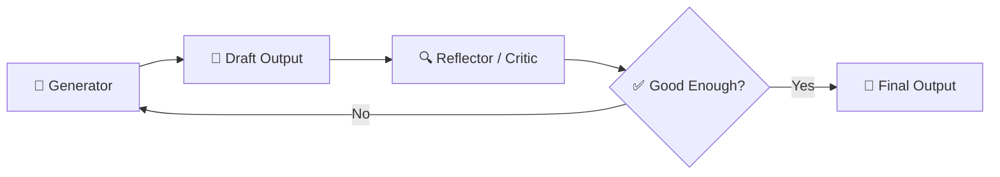
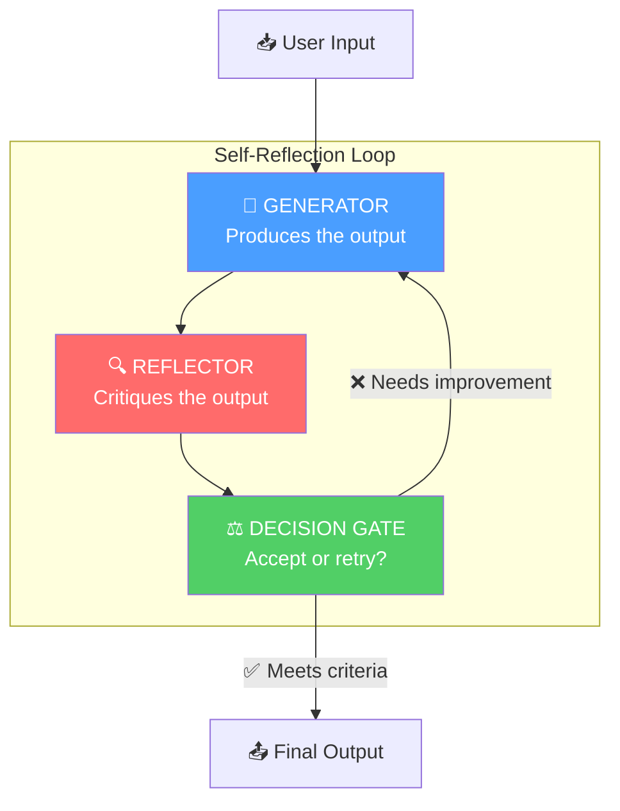
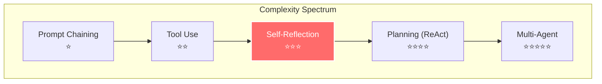
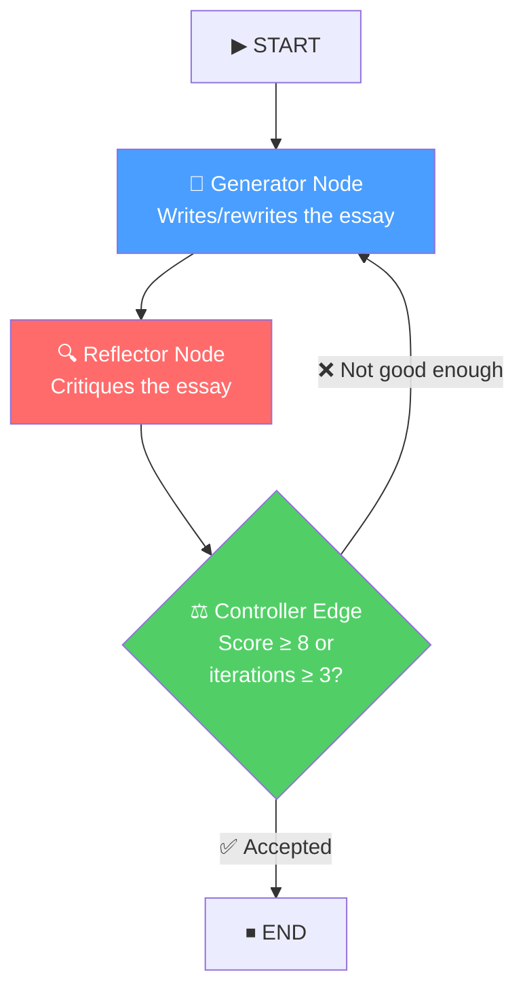

# The Self-Reflection (Reflexion) Agentic Pattern — In Depth

## Table of Contents
1. [What Is It?](#what-is-it)
2. [Why Does It Matter?](#why-does-it-matter)
3. [How It Works — Architecture](#how-it-works--architecture)
4. [Comparison With Other Agentic Patterns](#comparison-with-other-agentic-patterns)
5. [Real-World Use Cases](#real-world-use-cases)
6. [Building It From Scratch (LangGraph)](#building-it-from-scratch-langgraph)
7. [Key Takeaways](#key-takeaways)

---

## What Is It?

**Self-Reflection** (also called **Reflexion**) is an agentic AI design pattern where an LLM generates an output, then **evaluates its own output**, and uses that evaluation to **iteratively improve** the result — all within a single agentic workflow.

Think of it as giving an AI the ability to **proofread, critique, and rewrite its own work** — the same way a skilled human writer drafts, reviews, and polishes an essay before submission.



### The Core Idea

Most LLM calls are **single-shot**: you prompt, you get a response, you're done. Self-reflection breaks this paradigm by introducing a **feedback loop**:

1. **Generate** — The LLM produces an initial output (draft)
2. **Reflect** — The LLM (or a separate evaluator) critiques that output against defined criteria
3. **Decide** — Based on the reflection, either accept the output or loop back for refinement
4. **Refine** — If not accepted, the generator uses the critique to produce an improved version

This loop continues until the output meets quality thresholds or a maximum iteration count is reached.

> [!IMPORTANT]
> Self-reflection is fundamentally different from simply "re-prompting" or "retrying." The key distinction is that **the critique from the reflection step is fed back as context**, allowing the generator to make *targeted* improvements rather than starting from scratch.

---

## Why Does It Matter?

### The Problem With Single-Shot LLM Calls

Single-shot LLM calls have inherent limitations:

| Problem | Description |
|---------|-------------|
| **No self-awareness** | The LLM doesn't know if its output is good or bad |
| **No error correction** | Mistakes in the first generation persist to the final output |
| **Inconsistent quality** | Output quality varies wildly between runs |
| **Missing requirements** | Complex instructions are often partially fulfilled |
| **Hallucination** | False information goes undetected and uncorrected |

### What Self-Reflection Solves

| Benefit | How |
|---------|-----|
| **Higher quality outputs** | Multiple passes catch errors and fill gaps |
| **Requirement compliance** | The reflector checks if all criteria are met |
| **Reduced hallucination** | Fact-checking in the reflection step catches fabrications |
| **Consistent quality floor** | Even if the first draft is weak, iteration brings it up |
| **Explainability** | The reflection trace shows *why* changes were made |

> [!TIP]
> Self-reflection is especially powerful for tasks where **quality matters more than speed** — code generation, essay writing, research summaries, data analysis, and complex reasoning.

---

## How It Works — Architecture

### The Three Core Components



#### 1. Generator (Actor)
- Receives the original task + any previous critique
- Produces a candidate output
- On subsequent iterations, it has access to:
  - The original task
  - Its previous attempt(s)
  - The reflection/critique from the evaluator

#### 2. Reflector (Critic / Evaluator)
- Receives the generated output and the original task requirements
- Evaluates the output against defined criteria
- Produces structured feedback: what's good, what's wrong, what to improve
- Can be:
  - **The same LLM** with a different system prompt (most common)
  - **A different, stronger LLM** (e.g., GPT-4o critiquing GPT-4o-mini)
  - **A rule-based evaluator** (e.g., code compilation check, test runner)
  - **A hybrid** of LLM + deterministic checks

#### 3. Decision Gate (Controller)
- Examines the reflection output
- Decides: **accept** the current output or **loop back** for another iteration
- Uses criteria like:
  - Quality score threshold
  - Maximum iteration count (safety valve)
  - Specific pass/fail conditions

### State Management

The state is the **memory** of the reflection loop. It typically contains:

```python
class ReflectionState(TypedDict):
    task: str                    # The original user request
    draft: str                   # Current generated output  
    reflection: str              # Latest critique/feedback
    drafts: list[str]            # History of all drafts (optional)
    reflections: list[str]       # History of all reflections (optional)
    iteration: int               # Current iteration count
    accepted: bool               # Whether the output is accepted
```

> [!NOTE]
> Keeping the history of all drafts and reflections is optional but valuable — it prevents the generator from making the same mistakes repeatedly and provides an audit trail.

---

## Comparison With Other Agentic Patterns

Understanding where self-reflection fits among other agentic patterns:

| Pattern | How It Works | When to Use |
|---------|-------------|-------------|
| **Prompt Chaining** | Sequential steps, no feedback loops | Simple linear workflows |
| **Tool Use** | LLM calls external tools (search, code exec) | When external data/actions needed |
| **Planning (ReAct)** | Think → Act → Observe loop | Complex multi-step tasks |
| **Self-Reflection** | Generate → Critique → Refine loop | Quality-critical single outputs |
| **Multi-Agent** | Multiple specialized agents collaborate | Complex systems with division of labor |
| **Human-in-the-Loop** | Human reviews and approves at checkpoints | High-stakes decisions |



> [!TIP]
> Self-Reflection can be **combined** with other patterns. For example, you can use self-reflection *within* a multi-agent system, or combine it with tool use (e.g., reflect by running unit tests on generated code).

---

## Real-World Use Cases

### 1. Code Generation & Debugging
The generator writes code. The reflector runs tests, checks for bugs, and verifies correctness. If tests fail, the code is regenerated with the error feedback.

### 2. Essay / Content Writing
The generator writes a draft. The reflector checks for structure, coherence, factual accuracy, tone, and completeness. Weak sections are rewritten.

### 3. Research Summarization
The generator summarizes a paper. The reflector verifies key findings are covered, checks for misrepresentations, and ensures the summary is faithful to the source.

### 4. Data Analysis
The generator produces an analysis. The reflector validates the methodology, checks calculations, and verifies that conclusions follow from the data.

### 5. SQL / Query Generation
The generator writes a SQL query. The reflector runs it against a test database, checks results, and refines for edge cases.

---

## Building It From Scratch (LangGraph)

Now let's build a complete, working self-reflection agent using LangGraph. We'll create an **essay writing agent** that:
1. Takes a topic as input
2. Generates a draft essay
3. Reflects on the draft (structure, depth, accuracy, coherence)
4. Iteratively improves until the quality meets a threshold or max iterations are reached

### Architecture of Our Implementation



### Full Implementation

Here is the complete code, broken down section by section:

#### Step 1: Imports and Setup

```python
from langgraph.graph import StateGraph, START, END
from langchain_openai import ChatOpenAI
from typing import TypedDict, Literal, Annotated
from dotenv import load_dotenv
from pydantic import BaseModel, Field
import operator

load_dotenv()

# Using GPT-4o-mini for both generator and reflector
# In production, you might use a stronger model for reflection
model = ChatOpenAI(model='gpt-4o-mini', temperature=0.7)
```

> [!NOTE]
> We use `temperature=0.7` for creativity in generation. For the reflector, you might want `temperature=0` for more deterministic, consistent critiques.

#### Step 2: Define the State

The state is the backbone of the reflection loop — it carries all context between nodes:

```python
# Structured output for the reflector
class ReflectionOutput(BaseModel):
    """Structured reflection output with quality scores and feedback."""
    
    strengths: str = Field(description="What the essay does well")
    weaknesses: str = Field(description="Specific problems and areas for improvement")
    suggestions: str = Field(description="Concrete, actionable suggestions for the next draft")
    score: int = Field(
        description="Overall quality score from 1-10. "
                    "1-3: Poor, 4-5: Below average, 6-7: Good, 8-9: Very good, 10: Excellent",
        ge=1, le=10
    )


# Custom reducer: append new items to a list (for tracking history)
def add_to_list(existing: list, new: list) -> list:
    """Reducer that appends new items to the existing list."""
    return existing + new


class ReflectionState(TypedDict):
    topic: str                                                          # Original user request
    draft: str                                                          # Current essay draft
    reflection: str                                                     # Latest reflection text
    score: int                                                          # Latest quality score
    drafts: Annotated[list[str], add_to_list]                           # History of all drafts
    reflections: Annotated[list[str], add_to_list]                      # History of all reflections
    iteration: Annotated[int, operator.add]                             # Current iteration (auto-incremented)
```

> [!IMPORTANT]
> Notice the `Annotated` types with **reducers**. In LangGraph, reducers define *how* state updates are merged:
> - `add_to_list`: Appends new drafts/reflections to the history list
> - `operator.add`: Adds to the iteration counter (so each node that returns `{"iteration": 1}` increments it)
>
> This is critical because without reducers, each node would *overwrite* the list/counter instead of accumulating.

#### Step 3: Define the Generator Node

The generator writes or rewrites the essay. On the first iteration, it writes from scratch. On subsequent iterations, it uses the reflection feedback to improve:

```python
def generator_node(state: ReflectionState) -> dict:
    """
    Generate or refine an essay based on the topic and any previous reflection.
    
    First iteration: Writes a fresh draft from the topic alone.
    Subsequent iterations: Rewrites using the reflection feedback as guidance.
    """
    topic = state["topic"]
    iteration = state.get("iteration", 0)
    
    if iteration == 0:
        # ----- FIRST DRAFT (no prior feedback) -----
        prompt = f"""You are an expert essay writer. Write a well-structured, 
insightful essay on the following topic.

Topic: {topic}

Requirements:
- Clear thesis statement in the introduction
- 3-4 body paragraphs with supporting evidence and examples
- Logical flow between paragraphs with smooth transitions
- A compelling conclusion that synthesizes the main points
- Engaging writing style appropriate for an educated audience
- Approximately 500-700 words

Write the essay now:"""
    else:
        # ----- REFINEMENT (uses previous draft + reflection) -----
        previous_draft = state["draft"]
        reflection = state["reflection"]
        
        # Include history for context (prevents repeating mistakes)
        history_context = ""
        if len(state.get("drafts", [])) > 1:
            history_context = f"""
Previous iterations: {len(state['drafts'])}
Note: You have already revised this essay {len(state['drafts']) - 1} time(s). 
Focus on the LATEST feedback and avoid re-introducing issues from earlier drafts.
"""
        
        prompt = f"""You are an expert essay writer revising your work based on 
detailed feedback from a critic.

Original Topic: {topic}
{history_context}

Your Previous Draft:
---
{previous_draft}
---

Critic's Feedback:
---
{reflection}
---

Instructions:
- Address EVERY weakness and suggestion mentioned in the feedback
- Preserve the strengths that were noted
- Maintain or improve the overall structure
- Do NOT simply add disclaimers or meta-commentary about the changes
- Write the COMPLETE revised essay (not just the changed parts)

Write the improved essay now:"""

    response = model.invoke(prompt)
    new_draft = response.content
    
    return {
        "draft": new_draft,
        "drafts": [new_draft],       # Appended to history via reducer
        "iteration": 1,              # Incremented via operator.add reducer
    }
```

> [!TIP]
> **Key design decision**: The generator receives the *full previous draft* plus the *reflection*, not just the reflection alone. This allows it to preserve what was good while fixing what was bad. Including the history context prevents the common failure mode of "fix one thing, break another."

#### Step 4: Define the Reflector Node

The reflector critiques the draft using structured output for consistent, parseable feedback:

```python
# Create a structured output model for consistent reflections
reflector_model = model.with_structured_output(ReflectionOutput)

def reflector_node(state: ReflectionState) -> dict:
    """
    Critically evaluate the current draft against quality criteria.
    
    Produces structured feedback with strengths, weaknesses, 
    suggestions, and a numeric quality score.
    """
    topic = state["topic"]
    draft = state["draft"]
    iteration = state.get("iteration", 1)
    
    # Build context from previous reflections (if any)
    previous_reflections = ""
    if state.get("reflections"):
        previous_reflections = f"""
Previous Reflections (for context — check if earlier issues were fixed):
---
{chr(10).join(f"Iteration {i+1}: {r}" for i, r in enumerate(state["reflections"]))}
---
"""
    
    prompt = f"""You are a demanding but fair essay critic and writing professor.
Evaluate the following essay draft rigorously against these criteria:

1. **Thesis & Argument** (Is there a clear, debatable thesis? Is it well-supported?)
2. **Structure & Organization** (Logical flow? Clear paragraphs? Good transitions?)
3. **Evidence & Depth** (Specific examples? Deep analysis vs. surface-level?)
4. **Writing Quality** (Clarity? Engagement? Appropriate tone? Grammar?)
5. **Completeness** (Does it fully address the topic? Any missing perspectives?)

This is iteration {iteration} of the revision process.
{previous_reflections}

Topic: {topic}

Essay Draft:
---
{draft}
---

Be specific in your feedback. Point to exact sentences or paragraphs when 
discussing weaknesses. Your suggestions should be concrete and actionable.

IMPORTANT: Be honest with scoring. 
- Score 1-3 for essays with fundamental problems
- Score 4-5 for below-average essays  
- Score 6-7 for good but improvable essays
- Score 8-9 for very good essays with minor issues
- Score 10 for exceptional essays only"""

    reflection = reflector_model.invoke(prompt)
    
    # Format the reflection as readable text for the generator
    reflection_text = f"""## Reflection (Iteration {iteration})

**Score: {reflection.score}/10**

### Strengths
{reflection.strengths}

### Weaknesses  
{reflection.weaknesses}

### Suggestions for Improvement
{reflection.suggestions}"""
    
    return {
        "reflection": reflection_text,
        "reflections": [reflection_text],  # Appended to history via reducer
        "score": reflection.score,
    }
```

> [!NOTE]
> Using **structured output** (`with_structured_output`) for the reflector is crucial. It ensures:
> 1. The score is always a valid integer (1-10) — essential for the decision gate
> 2. Feedback is consistently organized into strengths/weaknesses/suggestions
> 3. The generator gets predictable, well-formatted feedback to work with

#### Step 5: Define the Decision Gate (Conditional Edge)

The controller decides whether to accept the current draft or send it back for another revision:

```python
def should_continue(state: ReflectionState) -> Literal["generator", "__end__"]:
    """
    Decision gate: determines whether to accept the draft or refine further.
    
    Accepts if:
    - Quality score >= 8 (meets quality threshold)
    - OR iteration count >= 3 (safety valve to prevent infinite loops)
    
    Returns the name of the next node to execute.
    """
    score = state.get("score", 0)
    iteration = state.get("iteration", 0)
    
    MAX_ITERATIONS = 3
    QUALITY_THRESHOLD = 8
    
    if score >= QUALITY_THRESHOLD:
        print(f"✅ Draft accepted! Score: {score}/10 after {iteration} iteration(s)")
        return "__end__"
    
    if iteration >= MAX_ITERATIONS:
        print(f"⚠️ Max iterations ({MAX_ITERATIONS}) reached. Final score: {score}/10")
        return "__end__"
    
    print(f"🔄 Iteration {iteration}: Score {score}/10 — sending back for revision...")
    return "generator"
```

> [!WARNING]
> **Always include a maximum iteration limit!** Without it, if the reflector is too strict (or the generator can't improve), you get an infinite loop that burns through API credits. 3-5 iterations is typically sufficient — most improvement happens in the first 2-3 rounds.

#### Step 6: Build the Graph

Now we wire everything together into a LangGraph workflow:

```python
# Create the graph
graph = StateGraph(ReflectionState)

# Add nodes
graph.add_node("generator", generator_node)
graph.add_node("reflector", reflector_node)

# Add edges
graph.add_edge(START, "generator")            # Start → Generator
graph.add_edge("generator", "reflector")       # Generator → Reflector
graph.add_conditional_edges(                   # Reflector → (Generator OR End)
    "reflector",
    should_continue
)

# Compile
workflow = graph.compile()
```

#### Step 7: Run It

```python
# Invoke the workflow
result = workflow.invoke({
    "topic": "The impact of artificial intelligence on creative professions: "
             "threat or transformation?",
    "drafts": [],
    "reflections": [],
    "iteration": 0,
    "score": 0,
    "draft": "",
    "reflection": "",
})

# Print the final essay
print("=" * 80)
print("FINAL ESSAY")
print("=" * 80)
print(result["draft"])
print("\n" + "=" * 80)
print(f"Final Score: {result['score']}/10")
print(f"Total Iterations: {result['iteration']}")
print(f"Total Drafts Generated: {len(result['drafts'])}")
```

#### Step 8: Inspect the Reflection History (Optional)

One of the great benefits of self-reflection is the **audit trail**:

```python
# Review the improvement journey
print("\n📊 REFLECTION HISTORY")
print("=" * 80)
for i, (draft, reflection) in enumerate(zip(result["drafts"], result["reflections"])):
    print(f"\n--- Draft {i + 1} ---")
    print(draft[:200] + "...")  # First 200 chars of each draft
    print(f"\n--- Reflection {i + 1} ---")
    print(reflection)
    print()
```

---

## Key Takeaways

> [!IMPORTANT]
> ### Summary of the Self-Reflection Pattern
> 
> 1. **What**: A generate → reflect → refine loop that iteratively improves LLM outputs
> 2. **Why**: Single-shot LLM calls miss errors, skip requirements, and produce inconsistent quality
> 3. **How**: Use separate Generator and Reflector roles (can be same or different LLMs), connected by a decision gate
> 4. **When**: Use for quality-critical outputs — code, essays, analysis, any task where "good enough on first try" isn't reliable
> 5. **Guard rails**: Always set max iterations and quality thresholds to prevent infinite loops

### Design Principles

| Principle | Details |
|-----------|---------|
| **Separation of concerns** | Generator and Reflector have distinct system prompts and objectives |
| **Structured feedback** | Use structured output for reflections to ensure consistent, parseable critiques |
| **History tracking** | Keep all drafts and reflections to prevent regression and enable auditing |
| **Safety valves** | Max iteration limits prevent runaway loops and excessive API costs |
| **Progressive refinement** | Each iteration should improve incrementally, not start from scratch |

### Common Pitfalls to Avoid

| Pitfall | Solution |
|---------|----------|
| Reflector is too lenient | Make the reflection prompt explicit about scoring criteria; use examples |
| Reflector is too strict | Set a reasonable quality threshold (7-8, not 10) |
| Generator ignores feedback | Include the reflection explicitly in the prompt; highlight specific issues |
| Infinite loops | Always have a max iteration limit |
| Regression (fix one thing, break another) | Include draft history in the generator prompt |
| High latency | Accept the tradeoff, or reduce max iterations for time-sensitive tasks |

---

> [!TIP]
> **Next steps**: Try combining self-reflection with **tool use** — for example, a code-writing agent that generates code, then *executes tests* as its reflection step. This gives you **ground-truth feedback** instead of LLM-based opinions, making the reflection loop dramatically more effective.
