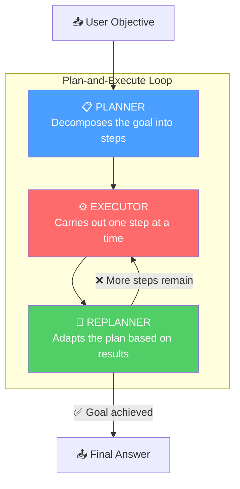
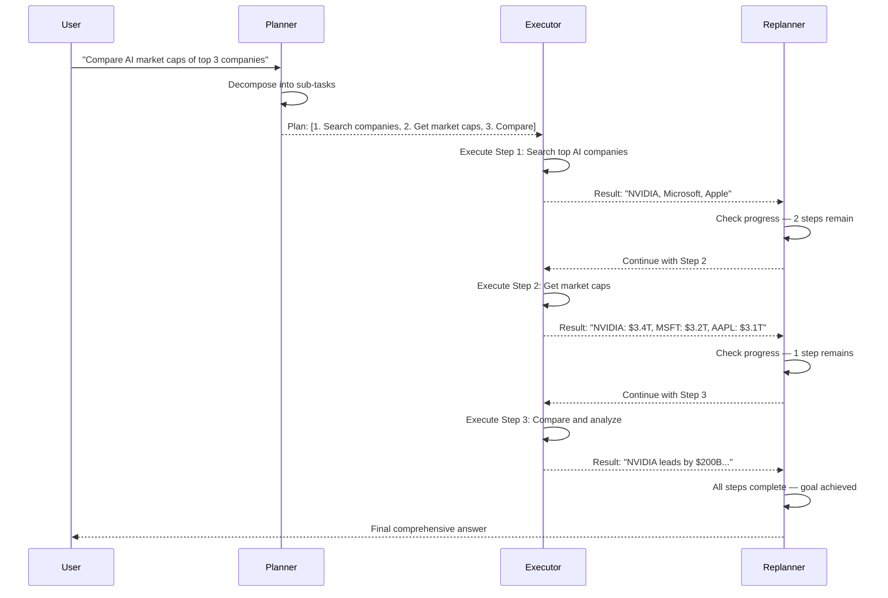
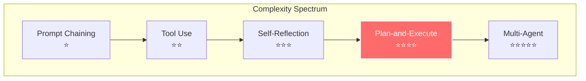
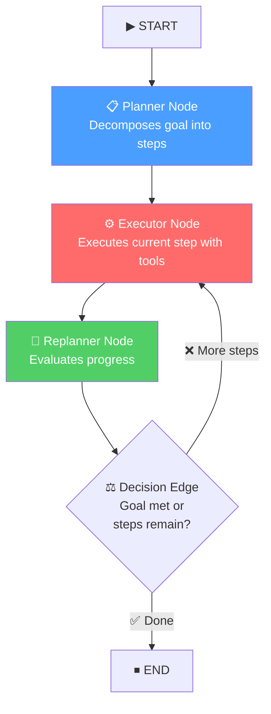

# The Plan-and-Execute Agentic Pattern — In Depth

## Table of Contents

1. [What Is It?](#what-is-it)
2. [Why Does It Matter?](#why-does-it-matter)
3. [How It Works — Architecture](#how-it-works--architecture)
4. [Comparison With Other Agentic Patterns](#comparison-with-other-agentic-patterns)
5. [Real-World Use Cases](#real-world-use-cases)
6. [Building It From Scratch (LangGraph)](#building-it-from-scratch-langgraph)
7. [Key Takeaways](#key-takeaways)

---

## What Is It?

**Plan-and-Execute** is an agentic AI design pattern where an LLM first **decomposes a complex goal into a structured plan** of sequential sub-tasks, then **executes each sub-task one at a time**, and optionally **replans** after each step based on what it learned — all within a single agentic workflow.

Think of it like a **project manager and a team of specialists**: the project manager (Planner) creates the roadmap, a worker (Executor) handles each task, and a supervisor (Replanner) reviews progress and adjusts the roadmap as reality unfolds.


### The Core Idea

Most simple agents operate in a **think-act-observe** loop (ReAct), deciding the next action one step at a time. Plan-and-Execute breaks this paradigm by introducing **explicit upfront planning**:

1. **Plan** — The LLM analyzes the full objective and produces a numbered list of sub-tasks
2. **Execute** — A dedicated executor (often a ReAct agent with tools) handles the current sub-task
3. **Replan** — After execution, the system evaluates results and decides: continue with the plan, modify remaining steps, or finish
4. **Repeat** — Steps 2-3 loop until all tasks are complete or the goal is satisfied

> [!IMPORTANT]
> Plan-and-Execute is fundamentally different from a simple ReAct loop. The key distinction is that **strategic planning is separated from tactical execution**. The planner thinks about the *big picture* while the executor focuses on *one task at a time*. This separation of concerns mirrors how effective human teams operate.

### Academic Origins

The pattern draws from the **"Plan-and-Solve Prompting"** paper by Wang et al. (2023), which showed that forcing LLMs to explicitly decompose problems into plans before solving them significantly reduces missing-step errors, calculation mistakes, and semantic misunderstandings compared to standard chain-of-thought prompting.

---

## Why Does It Matter?

### The Problem With Step-by-Step (ReAct) Agents

Standard ReAct agents decide what to do **one action at a time**. This works well for simple tasks, but creates problems at scale:

| Problem | Description |
|---------|-------------|
| **No global strategy** | The agent can't see the full path — it only knows the next step |
| **Gets lost in long tasks** | After 5-10 steps, the agent often loses track of the original goal |
| **Infinite loops** | Without a plan, agents can repeat the same actions endlessly |
| **Expensive reasoning** | The full LLM reasoning engine runs for every micro-decision |
| **Poor decomposition** | Complex goals with dependencies are handled ad-hoc |

### What Plan-and-Execute Solves

| Benefit | How |
|---------|-----|
| **Global coherence** | The upfront plan ensures all sub-tasks align with the overall goal |
| **Long-horizon tasks** | A structured plan prevents the agent from losing its way |
| **Cost efficiency** | Use a powerful model to plan, a lighter model to execute |
| **Inspectability** | The plan is a readable artifact — humans can review/edit before execution |
| **Adaptability** | The replanning step adjusts the strategy when reality diverges from the plan |
| **Reduced hallucination** | Each sub-task is scoped and specific, reducing room for fabrication |

> [!TIP]
> Plan-and-Execute is especially powerful for tasks that are **complex, multi-step, and tool-heavy** — research workflows, data pipelines, travel planning, multi-API orchestration, and any goal that requires coordinating 5+ steps.

---

## How It Works — Architecture

### The Three Core Components



#### 1. Planner (Strategist)

- Receives the user's high-level objective
- Analyzes what needs to be done to achieve the goal
- Produces a **structured, ordered list of sub-tasks**
- Considers dependencies between steps (what must come before what)
- Typically uses a **stronger, more capable model** (e.g., GPT-4o, Claude Sonnet)

#### 2. Executor (Worker)

- Takes **one sub-task at a time** from the plan
- Has access to **tools** (web search, calculators, APIs, code execution, etc.)
- Focuses entirely on completing the current task — no strategic thinking
- Can be a full ReAct agent itself, or a simpler tool-calling agent
- Can use a **lighter, faster model** (e.g., GPT-4o-mini) since reasoning is scoped

#### 3. Replanner (Supervisor)

- Receives the **original objective**, the **current plan**, and **all completed steps with results**
- Evaluates: Is the goal achieved? Is the plan still valid?
- Can produce one of two outputs:
  - **Updated plan**: Modified remaining steps based on new information
  - **Final response**: The goal has been met — synthesize and return the answer

### State Management

The state is the **shared memory** that flows through the entire workflow:

```python
class PlanExecuteState(TypedDict):
    input: str                                           # Original user objective
    plan: list[str]                                      # Current list of sub-tasks
    past_steps: Annotated[list[tuple], operator.add]     # History: (task, result) pairs
    response: str                                        # Final answer (when done)
```

> [!NOTE]
> The `past_steps` field uses a **reducer** (`operator.add`) so that each executor invocation *appends* its result to the history rather than overwriting it. This accumulation is critical — it gives the replanner full context of everything that's been accomplished.

### The Execution Flow — Step by Step



---

## Comparison With Other Agentic Patterns

Understanding where Plan-and-Execute fits among other agentic patterns:

| Pattern | How It Works | When to Use |
|---------|-------------|-------------|
| **Prompt Chaining** | Sequential steps, fixed pipeline, no loops | Simple linear workflows |
| **Tool Use** | LLM calls external tools reactively | When external data/actions needed |
| **ReAct** | Think → Act → Observe loop (one step at a time) | Simple, exploratory tasks |
| **Self-Reflection** | Generate → Critique → Refine loop | Quality-critical single outputs |
| **Plan-and-Execute** | Plan → Execute → Replan loop | Complex multi-step goals |
| **Multi-Agent** | Multiple specialized agents collaborate | Complex systems with division of labor |

### Plan-and-Execute vs. ReAct — The Key Distinction

| Dimension | ReAct | Plan-and-Execute |
|-----------|-------|-----------------|
| **Strategy** | Emergent (one step at a time) | Explicit (upfront plan) |
| **Global awareness** | Low — myopic decisions | High — sees the full picture |
| **Flexibility** | Very high — fully adaptive | Moderate — adapts via replanning |
| **Long tasks (10+ steps)** | Struggles, loses coherence | Excels, stays on track |
| **Short tasks (1-3 steps)** | Perfect fit, fast | Overkill, unnecessary overhead |
| **Cost** | High (full reasoning every step) | Lower (cheap executor, expensive planner only once) |
| **Inspectability** | Low — interleaved reasoning | High — plan is a readable artifact |
| **Best model pairing** | Single strong model | Strong planner + light executor |



> [!TIP]
> **Hybrid approach**: In production, many systems use Plan-and-Execute at the *macro* level and ReAct at the *micro* level — the planner creates the roadmap, and each step is executed by a ReAct agent with tools. This gives you the best of both worlds: global strategy + local adaptability.

---

## Real-World Use Cases

### 1. Research & Report Generation

The planner breaks a research question into: identify sources → gather data → cross-reference → synthesize findings → write report. Each step is executed independently with web search and document retrieval tools.

### 2. Travel Planning

The planner decomposes "Plan a 7-day trip to Japan" into: research destinations → check flights → find hotels → create daily itinerary → estimate budget. The executor uses flight APIs, hotel APIs, and travel guides.

### 3. Data Analysis Pipelines

The planner breaks down "Analyze Q4 sales trends" into: load data → clean/preprocess → compute metrics → generate visualizations → write summary. The executor runs Python code at each step.

### 4. Multi-API Orchestration

The planner decomposes "Set up a new customer account" into: validate input → create CRM record → provision cloud resources → send welcome email → log audit trail. Each step calls a different API.

### 5. Competitive Analysis

The planner creates a plan: identify competitors → gather pricing data → analyze feature sets → assess market positioning → create comparison matrix. The executor searches the web and populates structured data.

### 6. Debugging Complex Issues

The planner decomposes "Why is our API slow?" into: check error logs → profile endpoints → analyze database queries → identify bottlenecks → propose fixes. Each step uses different monitoring tools.

---

## Building It From Scratch (LangGraph)

Now let's build a complete, working Plan-and-Execute agent using LangGraph. We'll create a **research assistant** that:

1. Takes a user's research question as input
2. Plans the research steps needed
3. Executes each step using web search tools
4. Replans after each step (adapting if needed)
5. Synthesizes a final comprehensive answer

### Architecture of Our Implementation



### Full Implementation

Here is the complete code, broken down section by section:

#### Step 1: Imports and Setup

```python
from langgraph.graph import StateGraph, START, END
from langgraph.prebuilt import create_react_agent
from langchain_openai import ChatOpenAI
from langchain_community.tools.tavily_search import TavilySearchResults
from typing import TypedDict, Annotated, Union
from pydantic import BaseModel, Field
from dotenv import load_dotenv
import operator

load_dotenv()

# Strong model for planning — needs to reason about the big picture
planner_model = ChatOpenAI(model='gpt-4o', temperature=0)

# Lighter model for execution — just needs to follow instructions + use tools
executor_model = ChatOpenAI(model='gpt-4o-mini', temperature=0)
```

> [!NOTE]
> We deliberately use **two different models**: a powerful one for strategic planning and a lighter, cheaper one for execution. This is a key advantage of Plan-and-Execute — you save cost without sacrificing quality where it matters.

#### Step 2: Define the State and Schemas

The state carries the plan, execution history, and final answer across the workflow:

```python
# --- Structured Output Schemas ---

class Plan(BaseModel):
    """Ordered list of steps to achieve the user's goal."""
    steps: list[str] = Field(
        description="A list of steps to follow, in order. "
                    "Each step should be a clear, actionable task."
    )


class ReplanOutput(BaseModel):
    """Output of the replanner — either an updated plan or a final response."""
    updated_plan: list[str] = Field(
        default=None,
        description="Updated list of remaining steps (if more work needed)"
    )
    response: str = Field(
        default=None,
        description="Final response to the user (if goal is achieved)"
    )


# --- Graph State ---

class PlanExecuteState(TypedDict):
    input: str                                                  # Original user objective
    plan: list[str]                                             # Current plan (list of steps)
    past_steps: Annotated[list[tuple[str, str]], operator.add]  # (step, result) pairs
    response: str                                               # Final answer
```

> [!IMPORTANT]
> Notice `past_steps` uses `Annotated[..., operator.add]` as a **reducer**. This means each executor call *appends* its `(step, result)` tuple to the history. Without this, each node would overwrite previous steps and the replanner would lose context.

#### Step 3: Define the Planner Node

The planner takes the user's objective and decomposes it into an ordered list of sub-tasks:

```python
planner_with_structure = planner_model.with_structured_output(Plan)

def planner_node(state: PlanExecuteState) -> dict:
    """
    Decompose the user's objective into a structured, sequential plan.
    
    This is called ONCE at the start of the workflow. The planner analyzes
    the full goal and creates a roadmap of sub-tasks.
    """
    objective = state["input"]
    
    prompt = f"""You are an expert planning agent. Your job is to break down 
a complex objective into a clear, sequential plan of actionable steps.

Rules for creating the plan:
- Each step should be a SINGLE, specific, actionable task
- Steps should be in logical order (dependencies first)
- Each step should be self-contained enough for a worker to execute independently
- Include a final step to synthesize/compile the results into a final answer
- Keep the plan concise: 3-6 steps for most tasks (avoid over-decomposition)
- Consider what tools are available (web search) when planning steps

User's Objective: {objective}

Create the plan now:"""
    
    plan = planner_with_structure.invoke(prompt)
    
    print(f"📋 Plan created with {len(plan.steps)} steps:")
    for i, step in enumerate(plan.steps, 1):
        print(f"   {i}. {step}")
    
    return {"plan": plan.steps}
```

> [!TIP]
> **Key design decision**: The planner prompt explicitly tells the LLM to keep plans concise (3-6 steps). Without this, planners tend to over-decompose, creating 15+ micro-steps that inflate cost and latency. The sweet spot is steps that are big enough to be meaningful but small enough to be independently executable.

#### Step 4: Define the Executor Node

The executor takes the **next step** from the plan and carries it out using tools. We use a pre-built ReAct agent as the executor:

```python
# Set up tools for the executor
search_tool = TavilySearchResults(max_results=3)
tools = [search_tool]

# Create a ReAct agent as the executor — it can reason + use tools
executor_agent = create_react_agent(executor_model, tools)

def executor_node(state: PlanExecuteState) -> dict:
    """
    Execute the NEXT step in the plan using available tools.
    
    Takes the first incomplete step from the plan, runs a ReAct agent
    to complete it, and records the result in past_steps.
    """
    plan = state["plan"]
    past_steps = state.get("past_steps", [])
    
    # The current task is the first step in the remaining plan
    current_task = plan[0]
    
    # Build context from previous steps so the executor has full history
    context = ""
    if past_steps:
        context = "\n\nContext from previous steps:\n"
        for step, result in past_steps:
            context += f"- Task: {step}\n  Result: {result}\n"
    
    # Run the ReAct agent on the current task
    agent_input = {
        "messages": [
            ("user", f"""You are a research assistant executing one specific task.
Complete the following task thoroughly and provide a detailed result.
{context}
Current Task: {current_task}

Execute this task now and provide your findings:""")
        ]
    }
    
    result = executor_agent.invoke(agent_input)
    
    # Extract the final message content
    agent_response = result["messages"][-1].content
    
    print(f"\n⚙️ Executed: {current_task}")
    print(f"   Result: {agent_response[:150]}...")
    
    return {
        "past_steps": [(current_task, agent_response)],  # Appended via reducer
    }
```

> [!NOTE]
> The executor is itself a **ReAct agent** — this is the hybrid pattern in action. The macro-level structure is Plan-and-Execute (strategic), while the micro-level execution is ReAct (tactical). The executor gets context from all previous steps so it can build on earlier findings.

#### Step 5: Define the Replanner Node

The replanner evaluates progress and decides whether to continue, adjust the plan, or finish:

```python
replanner_with_structure = planner_model.with_structured_output(ReplanOutput)

def replanner_node(state: PlanExecuteState) -> dict:
    """
    Evaluate progress and decide: continue, replan, or finish.
    
    After each execution step, the replanner checks:
    1. Has the overall goal been achieved?
    2. Is the remaining plan still valid?
    3. Should the plan be adjusted based on new information?
    """
    objective = state["input"]
    plan = state["plan"]
    past_steps = state.get("past_steps", [])
    
    # Format past steps for the replanner
    past_steps_text = "\n".join(
        f"Step: {step}\nResult: {result}\n" for step, result in past_steps
    )
    
    # Format remaining plan
    remaining_steps = plan[1:]  # Skip the step that was just executed
    remaining_text = "\n".join(
        f"{i+1}. {step}" for i, step in enumerate(remaining_steps)
    ) if remaining_steps else "No remaining steps."
    
    prompt = f"""You are a planning supervisor evaluating the progress of a 
research task. Based on the work completed so far, decide what to do next.

Original Objective: {objective}

Work Completed So Far:
{past_steps_text}

Remaining Plan:
{remaining_text}

Instructions:
- If the original objective has been FULLY answered by the completed work, 
  set 'response' to a comprehensive final answer that synthesizes all findings.
- If more work is needed, set 'updated_plan' to the list of remaining steps 
  (you may modify, add, or remove steps based on what you've learned).
- Do NOT repeat steps that have already been completed.

Decide now:"""
    
    output = replanner_with_structure.invoke(prompt)
    
    if output.response:
        print(f"\n✅ Goal achieved! Generating final response...")
        return {"response": output.response}
    else:
        print(f"\n🔄 Replanned: {len(output.updated_plan)} steps remaining")
        return {"plan": output.updated_plan}
```

> [!WARNING]
> **The replanner is what makes this pattern adaptive.** Without it, you'd have a rigid pipeline that can't recover from unexpected results or adjust when new information changes the strategy. However, always be careful that the replanner doesn't endlessly add new steps — include a maximum step count as a safety valve.

#### Step 6: Define the Decision Edge

The routing function that determines whether to continue executing or finish:

```python
def should_end(state: PlanExecuteState) -> str:
    """
    Decision gate: determines whether the workflow is complete.
    
    Routes to END if a final response has been generated,
    otherwise routes back to the executor for the next step.
    """
    if state.get("response"):
        return END
    return "executor"
```

#### Step 7: Build the Graph

Wire everything together into a LangGraph workflow:

```python
# Create the graph
graph = StateGraph(PlanExecuteState)

# Add nodes
graph.add_node("planner", planner_node)
graph.add_node("executor", executor_node)
graph.add_node("replanner", replanner_node)

# Add edges
graph.add_edge(START, "planner")           # Start → Planner
graph.add_edge("planner", "executor")      # Planner → Executor
graph.add_edge("executor", "replanner")    # Executor → Replanner
graph.add_conditional_edges(               # Replanner → (Executor OR End)
    "replanner",
    should_end,
    {
        "executor": "executor",
        END: END,
    }
)

# Compile
workflow = graph.compile()
```

#### Step 8: Run It

```python
# Invoke the workflow
result = workflow.invoke({
    "input": "Compare the GDP growth rates of India, China, and the US "
             "over the last 3 years and explain the key drivers behind "
             "each country's performance.",
    "plan": [],
    "past_steps": [],
    "response": "",
})

# Print the final answer
print("=" * 80)
print("FINAL ANSWER")
print("=" * 80)
print(result["response"])
```

#### Step 9: Inspect the Execution History (Optional)

One of the great benefits of Plan-and-Execute is the **full audit trail**:

```python
# Review the step-by-step execution journey
print("\n📊 EXECUTION HISTORY")
print("=" * 80)
for i, (step, result) in enumerate(result["past_steps"], 1):
    print(f"\n--- Step {i} ---")
    print(f"Task: {step}")
    print(f"Result: {result[:300]}...")  # First 300 chars
    print()
```

---

## Key Takeaways

> [!IMPORTANT]
>
> ### Summary of the Plan-and-Execute Pattern
>
> 1. **What**: A plan → execute → replan loop that decomposes complex goals into manageable sub-tasks and executes them systematically
> 2. **Why**: Single-step agents lose coherence on long tasks, waste compute, and lack global strategy
> 3. **How**: Separate Planner (strategist), Executor (worker), and Replanner (supervisor) roles in a stateful graph
> 4. **When**: Use for complex, multi-step goals — research, data pipelines, multi-API orchestration, anything requiring 5+ coordinated steps
> 5. **Key advantage**: Use a strong model to plan once, a cheap model to execute many times — significant cost savings

### Design Principles

| Principle | Details |
|-----------|---------|
| **Separation of concerns** | Planner thinks strategically; Executor acts tactically; Replanner supervises |
| **Model tiering** | Use powerful models for planning, lighter models for execution — optimize cost |
| **Structured plans** | Use Pydantic models for plans to ensure consistent, parseable step lists |
| **Accumulated context** | Pass all past step results to the replanner so it can make informed decisions |
| **Adaptive replanning** | Don't just follow a rigid plan — adjust based on execution results |
| **Safety valves** | Set maximum step counts to prevent runaway execution loops |

### Common Pitfalls to Avoid

| Pitfall | Solution |
|---------|----------|
| Over-decomposition (too many tiny steps) | Instruct the planner to keep plans concise (3-6 steps) |
| Rigid plans that can't adapt | Always include a replanner that can modify remaining steps |
| Executor losing context | Pass accumulated past_steps so each execution builds on prior results |
| Infinite replanning loops | Set a maximum total step count (e.g., 10) as a hard stop |
| Planner hallucinating unavailable tools | Explicitly list available tools in the planner prompt |
| Expensive execution | Use a lighter model for the executor; reserve the powerful model for planning |

### When to Choose Plan-and-Execute Over Other Patterns

| Choose Plan-and-Execute When... | Choose Something Else When... |
|--------------------------------|------------------------------|
| The task has 5+ distinct steps | The task is simple (1-3 steps) → use ReAct |
| You need an inspectable roadmap | You need maximum flexibility → use ReAct |
| You want to optimize LLM costs | You need iterative quality improvement → use Self-Reflection |
| The task has clear sub-task boundaries | You need multiple specialized roles → use Multi-Agent |
| You want human-in-the-loop plan approval | The task is a single creative output → use Self-Reflection |

---

> [!TIP]
> **Next steps**: Try combining Plan-and-Execute with **Human-in-the-Loop** — generate the plan, present it to a human for approval/editing, *then* execute. This gives you the automation benefits of AI planning with the safety net of human oversight. In LangGraph, you can do this by adding an `interrupt_before=["executor"]` when compiling the graph.
