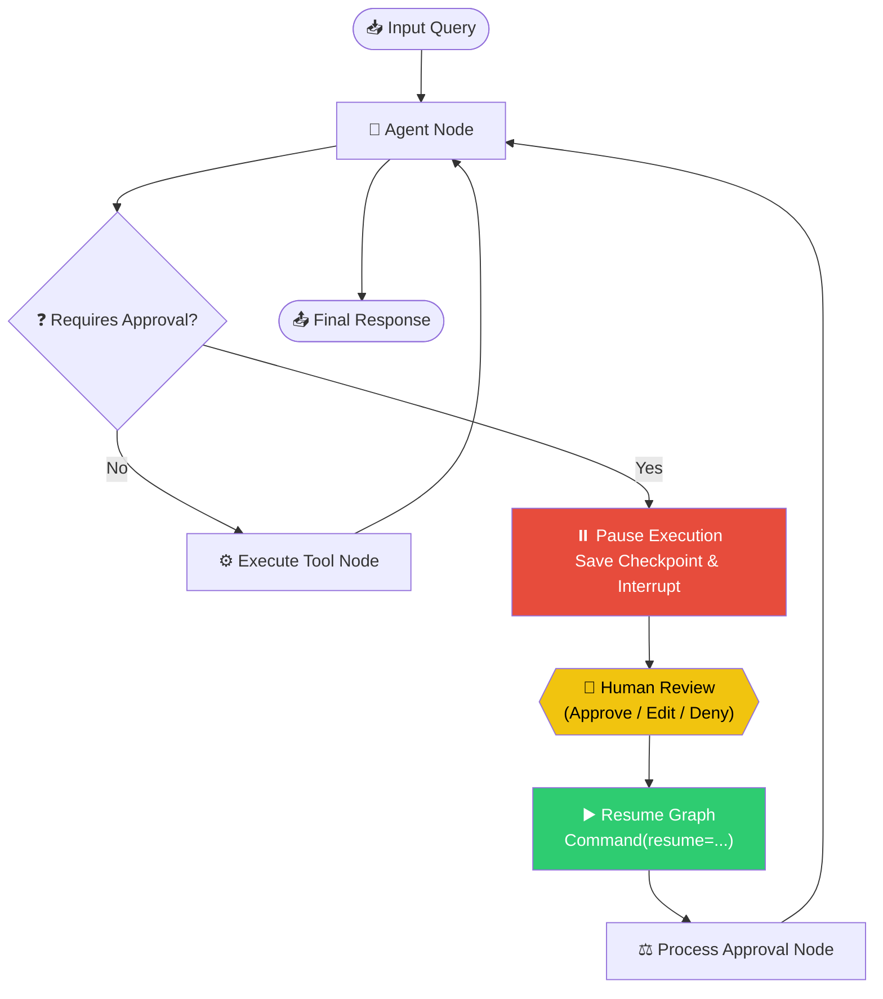

# The Human-in-the-Loop (HITL) Pattern — In Depth

## Table of Contents
1. [What Is It?](#what-is-it)
2. [Why Does It Matter?](#why-does-it-matter)
3. [How It Works — Architecture](#how-it-works--architecture)
4. [Comparison With Other Agentic Patterns](#comparison-with-other-agentic-patterns)
5. [Real-World Use Cases](#real-world-use-cases)
6. [Building It From Scratch (LangGraph)](#building-it-from-scratch-langgraph)
7. [Key Takeaways](#key-takeaways)

---

## What Is It?

The **Human-in-the-Loop (HITL)** pattern is an agentic design pattern where an autonomous system's execution is intentionally paused to solicit human input, feedback, or approval before resuming.

In a fully autonomous agentic loop, the LLM makes decisions, calls tools, and updates the state without external verification. In contrast, the HITL pattern establishes a control gate. When the graph encounters a high-risk node or tool, it suspends its thread of execution, saves the current state snapshot using a persistent checkpointer, and yields control back to the hosting application. 

Once a human supplies the necessary action (e.g. approving a purchase, correcting a drafted response, or providing runtime credentials), the application sends a resume signal along with the human's input, allowing the state machine to pick up exactly where it left off.



---

## Why Does It Matter?

While LLM agents can perform complex reasoning and multi-step actions, deploying them fully autonomously in production introduces substantial risks. The HITL pattern acts as a safety and quality assurance layer for several key reasons:

### 1. Risk Mitigation (Safety Gates)
Certain operations have real-world consequences that cannot be undone:
* Sending a real payment or stock purchase.
* Deleting data or altering system configurations.
* Sending external emails or publishing public posts.
By inserting a HITL gate, organizations maintain ultimate accountability over high-risk actions.

### 2. Error Correction & Loop Escapes
LLMs can get caught in infinite tool-calling loops (e.g., trying a failing tool over and over). A human can intercept a repeating error, correct a faulty tool input, or guide the agent out of the loop.

### 3. Context & Knowledge Enrichment
Often, an agent reaches a step where it lacks critical context (e.g. "What is the corporate account number?"). Instead of failing, the agent pauses, asks the human for the missing information, and integrates the human's reply directly into its active working memory.

> [!IMPORTANT]
> A robust HITL design must include a **State Checkpointer**. Without a checkpointer, pausing the system would lose all intermediate working memory, forcing the agent to restart the conversation from the beginning.

---

## How It Works — Architecture

In modern LangGraph (`langgraph>=0.2.0`), Human-in-the-Loop is built on three core pillars:

### 1. The Checkpointer (Persistence)
For a graph to pause and resume, it must save its state to a database or memory store. LangGraph uses a checkpointer (like `MemorySaver` or `SqliteSaver`) keyed by a unique `thread_id`. When an interrupt is triggered, the thread's exact message history and state variables are serialized.

### 2. The `interrupt()` Function
Any node or tool in the graph can call the `interrupt()` function:
```python
decision = interrupt("Approve this payment?")
```
Calling `interrupt()` does two things:
1. Immediately halts graph execution at that specific line.
2. Raises an interrupt flag containing the payload (e.g., `"Approve this payment?"`) which is passed back to the client application.

### 3. The `Command(resume=...)` Object
When the host application receives the interrupt and gathers the human's input, it resumes the graph by calling:
```python
app.invoke(Command(resume=human_decision), config=config)
```
The graph restarts the paused node/tool, replacing the `interrupt()` call with the value passed to `resume`. Execution then proceeds normally.

---

## Comparison With Other Agentic Patterns

| Pattern | Autonomy Level | State Boundaries | User Interaction | Primary Benefit |
| :--- | :--- | :--- | :--- | :--- |
| **ReAct (Tool Use)** | Full | Internal to thread | None | Rapid API execution and reasoning. |
| **Swarm / Network** | Full | Decentralized | None | Collaborative specialized workflows. |
| **Supervisor** | Full | Hierarchical | None | Centralized routing and delegation. |
| **Human-in-the-Loop** | **Semi-Autonomous** | **Checkpoint-Persisted** | **High (Interactive Gates)** | **Absolute safety, accountability, and error-correction.** |

---

## Real-World Use Cases

### 1. Financial Auditing and Purchasing
* **Scenario**: An autonomous procurement agent parses incoming invoices and prepares payment orders.
* **HITL Integration**: Any payment exceeding $500 triggers an `interrupt()`. The purchasing manager reviews the invoice and approves/declines it.

### 2. Autonomous Content Production
* **Scenario**: A social media manager agent researches trending topics, generates graphics, and drafts posts.
* **HITL Integration**: Before publishing a post, the agent pauses and presents the proposed post. The human editor can approve it, request changes, or edit the content directly.

### 3. Database Administration & System Operations
* **Scenario**: An IT support agent executes shell commands or SQL queries to resolve customer tickets.
* **HITL Integration**: Read-only commands run autonomously, but write/delete statements require explicit developer approval via a CLI or Web UI gate.

---

## Building It From Scratch (LangGraph)

Below is the complete implementation of a **CLI-based Stock Trading Assistant** that conducts search tasks autonomously, but pauses for human approval before executing any stock orders.

### 1. Define State and Tools
First, set up the agent's chat history state and tools. The purchase tool is marked as high-risk and incorporates the `interrupt()` call.

```python
from typing import Annotated, TypedDict
from langchain_core.messages import BaseMessage, HumanMessage
from langgraph.graph.message import add_messages
from langchain_core.tools import tool
from langgraph.types import interrupt

class ChatState(TypedDict):
    messages: Annotated[list[BaseMessage], add_messages]

@tool
def get_stock_price(symbol: str) -> dict:
    """Fetch the latest stock price for a symbol."""
    print(f"📊 [Tool] Fetching stock price for {symbol}...")
    return {"symbol": symbol, "price": 182.50}  # Mock response

@tool
def purchase_stock(symbol: str, quantity: int) -> dict:
    """
    Purchase shares of a stock.
    Requires human-in-the-loop approval before executing!
    """
    # Pauses graph execution and returns control to the runner
    decision = interrupt(f"Confirm purchase of {quantity} shares of {symbol}? (yes/no)")

    if isinstance(decision, str) and decision.lower().strip() == "yes":
        return {"status": "success", "message": f"Bought {quantity} shares of {symbol}!"}
    return {"status": "cancelled", "message": "Transaction declined by human approval."}
```

### 2. Setup the Graph Nodes & Compiler
Bind the tools to the LLM, construct the graph nodes, and compile with a persistent checkpointer.

```python
from langchain_openai import ChatOpenAI
from langgraph.graph import StateGraph, START
from langgraph.prebuilt import ToolNode, tools_condition
from langgraph.checkpoint.memory import MemorySaver

# Bind LLM
llm = ChatOpenAI(model="gpt-4o-mini", temperature=0)
tools = [get_stock_price, purchase_stock]
llm_with_tools = llm.bind_tools(tools)

def chat_node(state: ChatState):
    response = llm_with_tools.invoke(state["messages"])
    return {"messages": [response]}

# Build Graph
builder = StateGraph(ChatState)
builder.add_node("chat_node", chat_node)
builder.add_node("tools", ToolNode(tools))

builder.add_edge(START, "chat_node")
builder.add_conditional_edges("chat_node", tools_condition)
builder.add_edge("tools", "chat_node")

# Checkpointer is mandatory for HITL
memory = MemorySaver()
chatbot = builder.compile(checkpointer=memory)
```

### 3. Implement the Pausible CLI Loop
The outer application runner checks for the presence of the `__interrupt__` state key in the graph output. If present, it prompts the user, captures their decision, and resumes the thread using `Command(resume=...)`.

```python
from langgraph.types import Command

thread_id = "trading-session-1"
config = {"configurable": {"thread_id": thread_id}}

print("🚀 Stock Trading Assistant is online! Type 'exit' to quit.")

while True:
    user_input = input("\nYou: ")
    if user_input.lower().strip() in {"exit", "quit"}:
        break

    # Run the graph
    result = chatbot.invoke(
        {"messages": [HumanMessage(content=user_input)]},
        config=config,
    )

    # Check if the graph has paused on an interrupt
    interrupts = result.get("__interrupt__", [])
    
    if interrupts:
        prompt_to_human = interrupts[0].value
        print(f"\n⚠️  [HITL INTERRUPT]: {prompt_to_human}")
        decision = input("Your Decision (yes/no): ")
        
        # Resume the graph with the human decision
        result = chatbot.invoke(
            Command(resume=decision),
            config=config,
        )

    # Output latest response
    print(f"Bot: {result['messages'][-1].content}")
```

---

## Key Takeaways

> [!IMPORTANT]
>
> ### Summary of the HITL Pattern
>
> 1. **What**: An agentic control gate that suspends graph execution for human verification or data entry.
> 2. **Why**: Guarantees safety and accountability for critical, irreversible, or high-risk actions.
> 3. **How**: Combines LangGraph's dynamic `interrupt()` function, an external runner resuming via `Command(resume=...)`, and a persistent checkpointer.
> 4. **When**: Critical for applications executing transactions, mutating infrastructure, or generating external-facing communications.

### Core Principles

- **State Persistence is Mandatory**: Always supply a checkpointer (e.g. `MemorySaver` or `SqliteSaver`) during compilation, otherwise, the graph cannot resume from saved checkpoints.
- **Provide Actionable Interrupt Context**: Ensure the payload passed to `interrupt()` contains rich context (e.g., transaction details, exact actions, or warning statements) so the human has all information necessary to make a quick decision.
- **Clean Resumption Interface**: Ensure the node returning the resume command checks the datatype and sanitizes the input before committing the action to tool execution, keeping the execution safe.
