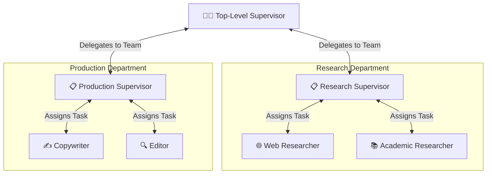
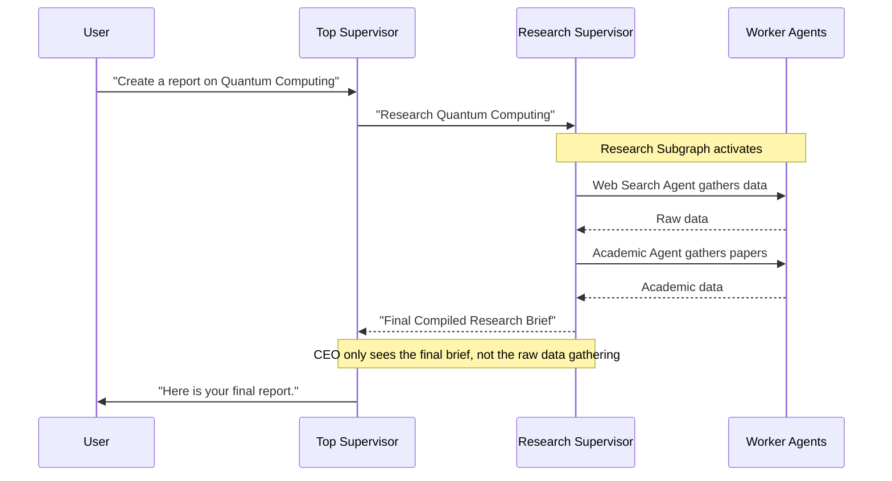

# Hierarchical Multi-Agent Pattern — In Depth

## Table of Contents
1. [What Is It?](#what-is-it)
2. [Why Does It Matter?](#why-does-it-matter)
3. [How It Works — Architecture](#how-it-works--architecture)
4. [Comparison With Other Agentic Patterns](#comparison-with-other-agentic-patterns)
5. [Real-World Use Cases](#real-world-use-cases)
6. [Building It From Scratch (LangGraph)](#building-it-from-scratch-langgraph)
7. [Key Takeaways](#key-takeaways)

---

## What Is It?

The **Hierarchical Multi-Agent Pattern** (or Nested Supervision) is an architecture where agents are organized into a management hierarchy. Instead of one supervisor managing all workers, a **Top-Level Supervisor** manages **Mid-Level Supervisors**, who in turn manage specialized **Worker Agents**.

Think of a **large corporation**: The CEO (Top-Level Supervisor) doesn't assign tasks directly to an individual graphic designer. The CEO assigns a campaign to the Marketing Director (Mid-Level Supervisor), who then delegates specific tasks to the Copywriter and Graphic Designer. Once the Marketing Director is satisfied with the campaign, they report back to the CEO.



### The Core Idea

In a standard Supervisor MAS, a single agent manages all workers. But as the number of specialized agents grows to 10, 20, or 50, a single supervisor becomes overwhelmed. Its context window fills with irrelevant details, and its routing decisions degrade.

The Hierarchical Pattern solves this by utilizing **Subgraphs** (in LangGraph). A team is built as its own independent state machine (subgraph), and the Top-Level Supervisor simply calls that entire subgraph as if it were a single node.

---

## Why Does It Matter?

### The Problem With Flat Supervisor Systems

| Problem | Description |
|---------|-------------|
| **Context Window Bloat** | If a single supervisor manages 15 agents, it must read the output of all 15 agents, leading to massive prompt sizes and expensive token usage. |
| **Cognitive Overload** | An LLM trying to choose between 15 different routing options often gets confused and makes the wrong choice. |
| **Monolithic Codebases** | Putting all agents into one giant graph makes the code difficult to maintain and test. |
| **Loss of Focus** | A top-level manager doesn't need to see the minor spelling corrections between a Writer and an Editor; they just need the final draft. |

### What Hierarchical MAS Solves

| Benefit | How |
|---------|-----|
| **Infinite Scalability** | You can scale to hundreds of agents by organizing them into logical departments. |
| **Information Hiding** | The Top-Level Supervisor only sees the final output of a department, not the internal back-and-forth chatter of the worker agents. |
| **Modular Development** | Different engineering teams can build and test their own subgraphs independently before plugging them into the main corporate graph. |
| **Focused Routing** | A supervisor only ever chooses between 3-5 options (e.g., Team A, Team B, or Finish), making LLM routing highly accurate. |

> [!TIP]
> The Hierarchical Pattern is the gold standard for enterprise-grade Agentic AI. If your system requires more than 5 distinct agent roles, you should almost certainly be using nested supervision.

---

## How It Works — Architecture

### The Core Components

#### 1. The Subgraphs (Departments/Teams)
Each department is a fully functional Multi-Agent System on its own. For example, a "Research Team" has its own `MessagesState`, its own Research Supervisor, and its own worker nodes. It compiles into an independent `workflow`.

#### 2. The Top-Level Graph (The Executive Board)
The top-level graph has its own `MessagesState` and its own Top-Level Supervisor. The nodes in this top-level graph are not individual agents; they are the compiled **Subgraphs** from Component 1. 

#### 3. State Isolation vs. State Sharing
This is the trickiest part of the architecture:
- **Internal Team Chatter:** When the Writer and Editor argue over a paragraph, those messages stay in the *Production Team's* state. 
- **Upward Reporting:** When the Production Team finishes, it returns a final summary message to the *Top-Level* state. The CEO sees the result, but not the messy drafting process.

### The Execution Flow



---

## Comparison With Other Agentic Patterns

| Dimension | Standard Supervisor | Network (Swarm) | Hierarchical MAS |
|-----------|--------------------|-----------------|------------------|
| **Structure** | Hub and Spoke | Peer-to-Peer Mesh | Tree / Nested Subgraphs |
| **Agent Limit** | ~5-7 before degradation | ~10 before chaos | Virtually unlimited |
| **Code Modularity**| Low (One big graph) | Low (Tangled edges) | High (Composable subgraphs) |
| **Context Sharing**| Global (Everyone sees everything) | Global (Usually) | Isolated (Teams have private state) |
| **Best For** | Small teams (3-5 agents) | Dynamic conversational loops | Enterprise scale, complex pipelines |

> [!IMPORTANT]
> Hierarchical MAS requires careful planning of your **State Schemas**. Because you are passing data between a parent graph and a child graph, you must ensure the inputs and outputs match exactly what the respective supervisors expect.

---

## Real-World Use Cases

### 1. Game Development Studio (AI Generated Games)
- **Top Supervisor**: Game Director.
- **Team 1 (Art Dept)**: Art Supervisor manages 2D Character Artist, Background Artist, and UI Designer.
- **Team 2 (Code Dept)**: Tech Lead manages Physics Programmer, Gameplay Programmer, and QA Tester.
- **Team 3 (Audio Dept)**: Audio Supervisor manages Composer and Foley Artist.

### 2. Large Scale Financial Auditing
- **Top Supervisor**: Chief Auditor.
- **Team 1 (Compliance)**: Reviews transactions against KYC/AML laws.
- **Team 2 (Risk Assessment)**: Analyzes market exposure.
- **Team 3 (Forensics)**: Looks for accounting anomalies in deep ledger data.

### 3. Comprehensive Marketing Agency
- **Top Supervisor**: Campaign Manager.
- **Team 1 (Market Research)**: Demographics agent, Competitor Analysis agent.
- **Team 2 (Creative)**: Copywriter agent, Graphic Generation agent.
- **Team 3 (Distribution)**: SEO agent, Social Media formatting agent.

---

## Building It From Scratch (LangGraph)

We will build a miniature **Content Agency**.
- **Top Supervisor**: The Director.
- **Research Team (Subgraph)**: A Research Supervisor managing a Web Searcher and a Wikipedia Searcher.
- **Writing Team (Subgraph)**: A Writing Supervisor managing a Copywriter and an Editor.

### Full Implementation

#### Step 1: Imports and Setup

```python
from langgraph.graph import StateGraph, START, END, MessagesState
from langchain_openai import ChatOpenAI
from langchain_core.messages import HumanMessage, SystemMessage
from pydantic import BaseModel, Field
from typing import Literal

# We will use mock tools for simplicity, but in a real app these would be real tools.
from langchain_core.tools import tool

import os
from dotenv import load_dotenv
load_dotenv()

model = ChatOpenAI(model='gpt-4o-mini', temperature=0)
```

#### Step 2: Define Mock Tools

```python
@tool
def web_search(query: str) -> str:
    """Mock web search."""
    return f"Web results for {query}: Rapid advancements in technology reported this year."

@tool
def wiki_search(query: str) -> str:
    """Mock Wikipedia search."""
    return f"Wiki page for {query}: History dates back several decades with key academic milestones."
```

#### Step 3: Build the Research Subgraph

A subgraph is just a standard LangGraph workflow. We build it exactly like a normal Supervisor pattern.

```python
from langgraph.prebuilt import create_react_agent

# 1. State and Supervisor Schema for Research Team
class ResearchState(MessagesState):
    next_agent: str

class ResearchTeamDecision(BaseModel):
    next: Literal["web_searcher", "wiki_searcher", "FINISH"]
    reasoning: str

# 2. Worker Agents
web_agent = create_react_agent(model, tools=[web_search])
wiki_agent = create_react_agent(model, tools=[wiki_search])

def web_node(state: ResearchState):
    result = web_agent.invoke(state)
    return {"messages": [HumanMessage(content=f"[WEB RESEARCHER]: {result['messages'][-1].content}", name="web_searcher")]}

def wiki_node(state: ResearchState):
    result = wiki_agent.invoke(state)
    return {"messages": [HumanMessage(content=f"[WIKI RESEARCHER]: {result['messages'][-1].content}", name="wiki_searcher")]}

# 3. Research Supervisor
def research_supervisor_node(state: ResearchState):
    sys_msg = SystemMessage(content=(
        "You are the Research Supervisor. Manage your team:\n"
        "- web_searcher: finds current news.\n"
        "- wiki_searcher: finds historical/background info.\n"
        "Call workers as needed. When you have enough info, output FINISH."
    ))
    decision = model.with_structured_output(ResearchTeamDecision).invoke([sys_msg] + state["messages"])
    # We update our custom state with the routing decision
    return {"next_agent": decision.next}

# 4. Routing Logic
def route_research(state: ResearchState) -> str:
    # Read the decision from the state
    if state["next_agent"] == "FINISH":
        return END
    return state["next_agent"]

# 5. Compile Subgraph
research_graph = StateGraph(ResearchState)
research_graph.add_node("supervisor", research_supervisor_node)
research_graph.add_node("web_searcher", web_node)
research_graph.add_node("wiki_searcher", wiki_node)

research_graph.add_edge(START, "supervisor")
# The router dictates where the supervisor goes next
research_graph.add_conditional_edges("supervisor", route_research, ["web_searcher", "wiki_searcher", END])
# Workers always report back to the supervisor
research_graph.add_edge("web_searcher", "supervisor")
research_graph.add_edge("wiki_searcher", "supervisor")

research_team_compiled = research_graph.compile()
```

#### Step 4: Build the Writing Subgraph

Similarly, we build the Writing Team. It has its own isolated state and specialized workers.

```python
# 1. State and Supervisor Schema for Writing Team
class WritingState(MessagesState):
    next_agent: str

class WritingTeamDecision(BaseModel):
    next: Literal["copywriter", "editor", "FINISH"]
    reasoning: str

# 2. Worker Agents
# Copywriter doesn't need external tools, just writes.
copywriter_agent = create_react_agent(model, tools=[])
# Editor uses grammar check
editor_agent = create_react_agent(model, tools=[])

def copywriter_node(state: WritingState):
    result = copywriter_agent.invoke(state)
    return {"messages": [HumanMessage(content=f"[COPYWRITER]: {result['messages'][-1].content}", name="copywriter")]}

def editor_node(state: WritingState):
    result = editor_agent.invoke(state)
    return {"messages": [HumanMessage(content=f"[EDITOR]: {result['messages'][-1].content}", name="editor")]}

# 3. Writing Supervisor
def writing_supervisor_node(state: WritingState):
    sys_msg = SystemMessage(content=(
        "You are the Writing Supervisor. Manage your team:\n"
        "- copywriter: to draft the content based on provided research.\n"
        "- editor: to review the draft and check grammar.\n"
        "Workflow: copywriter drafts -> editor reviews -> FINISH."
    ))
    decision = model.with_structured_output(WritingTeamDecision).invoke([sys_msg] + state["messages"])
    return {"next_agent": decision.next}

# 4. Routing Logic
def route_writing(state: WritingState) -> str:
    if state["next_agent"] == "FINISH":
        return END
    return state["next_agent"]

# 5. Compile Subgraph
writing_graph = StateGraph(WritingState)
writing_graph.add_node("supervisor", writing_supervisor_node)
writing_graph.add_node("copywriter", copywriter_node)
writing_graph.add_node("editor", editor_node)

writing_graph.add_edge(START, "supervisor")
writing_graph.add_conditional_edges("supervisor", route_writing, ["copywriter", "editor", END])
writing_graph.add_edge("copywriter", "supervisor")
writing_graph.add_edge("editor", "supervisor")

writing_team_compiled = writing_graph.compile()
```

#### Step 5: The Top-Level Executive Graph

The Top-Level graph treats the entire compiled Research Subgraph and Writing Subgraph as simple nodes. 

```python
# 1. Create Top-Level State and Decision Schema
class CorporateState(MessagesState):
    next_team: str

class CorporateDecision(BaseModel):
    next: Literal["research_team", "writing_team", "FINISH"]
    reasoning: str

# 2. Top-Level Supervisor (CEO)
def ceo_node(state: CorporateState):
    sys_msg = SystemMessage(content=(
        "You are the CEO. You manage two departments:\n"
        "- research_team: Gathers raw data.\n"
        "- writing_team: Writes the final article.\n"
        "Always research first, then write. When the article is written, output FINISH."
    ))
    decision = model.with_structured_output(CorporateDecision).invoke([sys_msg] + state["messages"])
    print(f"\n👔 CEO routes to -> {decision.next.upper()}")
    return {"next_team": decision.next}

def route_corporate(state: CorporateState) -> str:
    if state["next_team"] == "FINISH":
        return END
    return state["next_team"]

# 3. Information Hiding Wrappers
# These nodes pass the state to the subgraphs and extract only the final conclusion
def run_research_team(state: CorporateState) -> dict:
    result = research_team_compiled.invoke(state)
    final_message = result["messages"][-1]
    return {"messages": [AIMessage(content=f"[RESEARCH DEPT FINAL REPORT]:\n{final_message.content}", name="ResearchDept")]}

def run_writing_team(state: CorporateState) -> dict:
    result = writing_team_compiled.invoke(state)
    final_message = result["messages"][-1]
    return {"messages": [AIMessage(content=f"[WRITING DEPT FINAL DELIVERABLE]:\n{final_message.content}", name="WritingDept")]}

# 4. Compile Top Graph
corp_graph = StateGraph(CorporateState)

corp_graph.add_node("ceo", ceo_node)
corp_graph.add_node("research_team", run_research_team)
corp_graph.add_node("writing_team", run_writing_team)

corp_graph.add_edge(START, "ceo")
corp_graph.add_conditional_edges("ceo", route_corporate, ["research_team", "writing_team", END])
corp_graph.add_edge("research_team", "ceo")
corp_graph.add_edge("writing_team", "ceo")

corporate_workflow = corp_graph.compile()
```

---

## Key Takeaways

> [!IMPORTANT]
> ### Summary of the Hierarchical MAS Pattern
> 
> 1. **What**: A tree-like structure where a Top-Level Supervisor routes to Sub-Supervisors, who route to Worker Agents.
> 2. **Why**: Solves the context window explosion and routing degradation that happens when a single supervisor tries to manage too many specialized agents.
> 3. **How**: Implemented using **LangGraph Subgraphs**. Each department is an independently compiled graph that acts as a single node in the parent graph.
> 4. **When**: Use for Enterprise-scale problems requiring many specific roles (e.g., a software agency with distinct Art, Code, and QA departments).

### Design Principles

| Principle | Details |
|-----------|---------|
| **Information Hiding** | Child graphs should summarize their findings before returning to the parent graph. Do not pollute the CEO's context with the team's internal brainstorming. |
| **State Abstraction** | The parent state and child state are separate. You must carefully map the inputs from the parent down to the child, and the outputs from the child back up to the parent. |
| **Independent Testing** | Because each team is a compiled graph, you can (and should) invoke and test the Research Team completely independently of the CEO. |

### Common Pitfalls to Avoid

| Pitfall | Solution |
|---------|----------|
| **State Bleed** | Accidentally passing the entire CEO message history to the worker agents, confusing them. **Fix**: Filter the messages so a team only sees what the CEO specifically asked them to do. |
| **Over-engineering** | Using a hierarchy for a simple 3-agent task. **Fix**: Stick to a flat Supervisor MAS unless you exceed ~5 specialized agents or need strict information isolation. |
| **Silent Failures in Subgraphs** | A team gets stuck in an infinite loop, hanging the whole system. **Fix**: Implement iteration caps (`recursion_limit`) at the subgraph level. |
