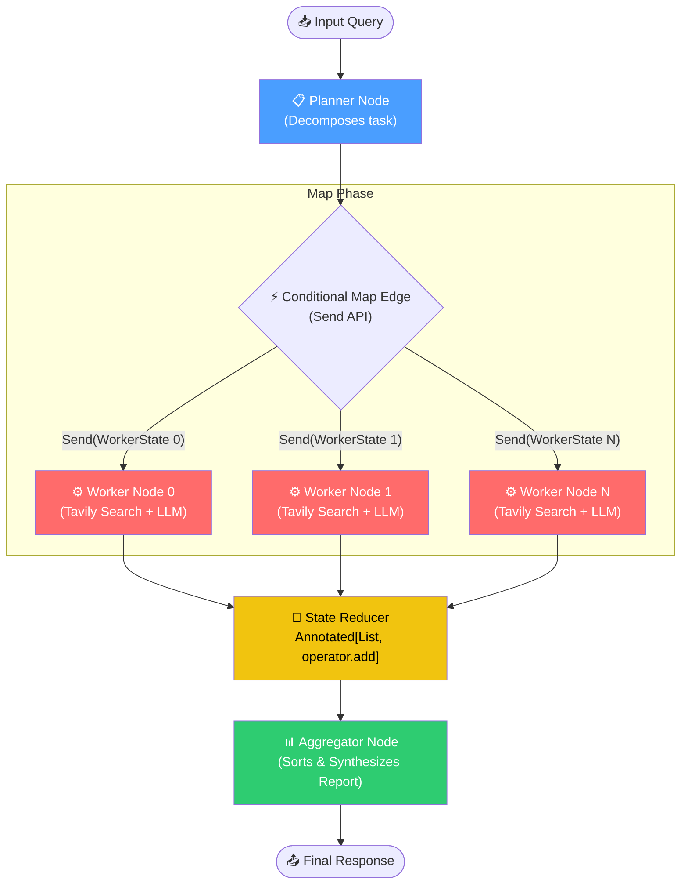
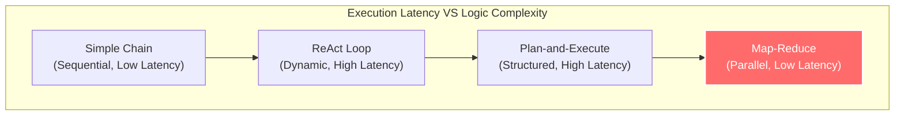

# The Parallel / Map-Reduce Agentic Pattern — In Depth

## Table of Contents

1. [What Is It?](#what-is-it)
2. [Why Does It Matter?](#why-does-it-matter)
3. [How It Works — Architecture](#how-it-works--architecture)
4. [Comparison With Other Agentic Patterns](#comparison-with-other-agentic-patterns)
5. [Real-World Use Cases](#real-world-use-cases)
6. [Building It From Scratch (LangGraph Internal Logic)](#building-it-from-scratch-langgraph-internal-logic)
7. [Key Takeaways](#key-takeaways)

---

## What Is It?

The **Parallel / Map-Reduce Pattern** is an agentic AI design pattern that allows a system to process multiple independent tasks simultaneously instead of sequentially. A coordinator (the **Planner**) decomposes a complex user query into a series of self-contained sub-tasks, dispatches them to a pool of concurrent workers (the **Map** phase), accumulates their outputs in a thread-safe state variable, and finally combines the results into a unified, high-quality output (the **Reduce** phase).



### The Core Idea

In standard agentic flows like **ReAct** or **Plan-and-Execute**, the agent operates inside a synchronous loop: it takes an action, waits for the tool result, updates its memory, and then plans the next action. This is a sequential chain.

The Map-Reduce pattern breaks this sequence. If a user asks to research three different companies, there is no logical dependency between them:
1. **Plan & Split**: An LLM splits the request into separate sub-requests: "Research SpaceX", "Research Blue Origin", and "Research Rocket Lab".
2. **Concurrence (Map)**: Three workers run *at the exact same time*. Each is handed a tiny, isolated slice of state containing only its assigned company.
3. **Accumulate & Reduce**: As the workers complete their jobs, their research is appended to a list. Once all workers are finished, a final aggregator node compiles the findings into a single comparative markdown matrix.

> [!IMPORTANT]
> The fundamental requirement for Map-Reduce is **sub-task independence**. If Task B requires information that Task A will discover, Map-Reduce cannot be used. In such scenarios, you must fallback to sequential execution (such as ReAct or Plan-and-Execute).

### Academic Origins

The Map-Reduce paradigm was popularized by Google (Dean & Ghemawat, 2004) for processing massive datasets across distributed server clusters. In the context of LLMs, this pattern represents a translation of distributed computing principles to cognitive architectures. 

Instead of routing massive context sizes into a single LLM call—which degrades model recall (the "lost-in-the-middle" phenomenon) and blows up costs—the Map-Reduce pattern uses structural division of labor to ensure high accuracy, fast execution, and strict context containment.

---

## Why Does It Matter?

### The Problem With Sequential Patterns

When executing long-horizon tasks, sequential patterns (like ReAct or multi-agent supervisor setups) suffer from significant engineering drawbacks:

| Problem | Technical Impact |
| :--- | :--- |
| **High Latency Bottleneck** | If a query requires searching 5 different websites, and each search takes 3 seconds, a sequential agent takes 15 seconds. In parallel, it takes 3 seconds total. |
| **Context Window Bleeding** | As a sequential agent loops, search results pile up in its messages list. The LLM gets distracted, reasoning accuracy drops, and input token costs scale quadratically. |
| **Cascade Failures** | If tool call #3 of 5 fails, the sequential chain stalls or loops. Retrying requires running the first two steps again. |
| **Resource Waste** | A single expensive reasoning model (e.g., GPT-4o) must run through the entire step-by-step loop, even when writing simple summaries. |

### The Advantages of Map-Reduce

| Benefit | How It Works |
| :--- | :--- |
| **Extreme Latency Reductions** | All network I/O and LLM reasoning steps run in parallel on the event loop, decreasing wait times for end users. |
| **Surgical Context Windows** | Each worker only receives the specific prompt and data slice for its task. The input size remains small, preventing hallucinations. |
| **Model Tiering & Optimization** | A highly capable planner (GPT-4o) creates the tasks and synthesizes the report. Fast, low-cost workers (GPT-4o-mini) execute the searches. |
| **Deterministic Reduction** | Even though execution is async and out-of-order, sorting results by their original index ensures reproducible final outputs. |

> [!TIP]
> Use Map-Reduce for large-scale operations: multi-source data ingestion, security scanning (auditing different code files concurrently), bulk translation, synthetic data generation, and comparative reporting.

---

## How It Works — Architecture

### The Five Pillars of Map-Reduce

#### 1. The Planner (Strategic Decomposer)
- Receives the raw user request.
- Breaks it down into discrete, self-contained sub-tasks.
- Uses **Structured Outputs** (e.g., Pydantic) to output a list of tasks. This guarantees that the parser can inspect, modify, or loop over the plan.
- Typically runs on a larger reasoning model.

#### 2. The Conditional Map Edge (Dynamic Router)
- Acts as the switchboard. Instead of routing control to a single node name (like `"executor"`), it returns a list of `Send` objects.
- Each `Send` object tells the graph: *"Spawn an independent instance of this worker node, and pass it this specific, tiny sub-state."*
- LangGraph intercepts this list and dynamically updates the execution queue.

#### 3. Parallel Worker Nodes (Tactical Executors)
- Spawned concurrently by the runtime engine.
- Each worker runs in complete isolation. It has no access to what other workers are doing.
- Workers can use tools (e.g., Tavily Search, database queries, code execution).
- Returns its result back to the graph.

#### 4. The State Reducer (Thread-Safe Join)
- Because multiple workers write their outputs simultaneously, a naive state merge would overwrite results.
- The State Schema defines the results channel using a **Reducer Function** (e.g., `operator.add`).
- LangGraph guarantees thread-safe, sequential updates to this list, appending each worker's output as they arrive.

#### 5. The Aggregator (Synthesizer)
- Once the worker queue is empty, the graph execution block resolves.
- The aggregator node is activated. It takes the list of accumulated worker outputs.
- To prevent out-of-order reporting, it **sorts** the outputs by their original index.
- Finally, it passes the organized content to a synthesis LLM to draft a structured executive report.

---

## Comparison With Other Agentic Patterns

Understanding when to select Map-Reduce over alternative design patterns:



| Pattern | Control Flow | Latency Profile | State Management | Ideal Use Case |
| :--- | :--- | :--- | :--- | :--- |
| **Chain-of-Thought / ReAct** | Iterative single loop | $O(N \times T)$ | Monolithic state, constantly updated | Exploratory search, debugging, interactive tools. |
| **Plan-and-Execute** | Sequential steps with replanning | $O(N \times T)$ | Plan list + step history | Multi-step research with logical dependencies (e.g., write script -> test it -> fix it). |
| **Network (Swarm)** | Dynamic handoffs between peers | $O(N \times T)$ | Passed message-by-message | Collaborative problem solving, customer routing. |
| **Parallel / Map-Reduce** | Concurrent fan-out / fan-in | $O(T_{\text{max}})$ | Sliced context fanned out, combined via Reducer | Batch operations, comparing multiple items, reading massive documents. |

---

## Real-World Use Cases

### 1. Automated Code Audits & Secret Scanners
- **Planner**: Scans a Git repository structure, compiles a list of code files to inspect.
- **Workers (Parallel)**: 50 instances of the worker node run concurrently. Each instance reads one code file, runs regex patterns and LLM linting, and extracts secrets/vulnerabilities.
- **Reducer**: Appends all findings to a global issues list.
- **Aggregator**: Filters duplicates, sorts by severity, and writes a compliance report.

### 2. Market Competitor Intelligence Report
- **Planner**: Given a client's query (e.g., "Analyze leading LLM providers"), it generates 3 target entities: OpenAI, Anthropic, and Google.
- **Workers (Parallel)**: Three workers run concurrently. Each conducts web searches for pricing, model releases, and API limits of its assigned provider.
- **Reducer**: Combines all raw research notes.
- **Aggregator**: Builds a markdown pricing matrix and outlines strengths/weaknesses.

### 3. Document Processing (PDF Chunking)
- **Planner**: Takes a 200-page financial statement and identifies 10 key sections (e.g., Balance Sheets, Cash Flows, Risk Factors).
- **Workers (Parallel)**: Each worker processes one section, extracting key financial tables.
- **Reducer**: Accumulates the tables into a structured database list.
- **Aggregator**: Computes year-over-year changes and builds an executive dashboard.

---

## Building It From Scratch (LangGraph Internal Logic)

To understand how LangGraph handles Map-Reduce under the hood, let us inspect the two primary mechanisms: **State Reducers** and the **`Send` API**.

### 1. State Reducers (`operator.add`)

In LangGraph, if multiple parallel nodes write to the same key, a race condition occurs. The node that finishes last overwrites all previous writes. 

To solve this, we define the channel using a reducer:
```python
from typing import Annotated, TypedDict
import operator

class MapReduceState(TypedDict):
    # The Annotated type wrapper tells LangGraph to pass updates to operator.add.
    # When Worker 1 returns [Result A] and Worker 2 returns [Result B], 
    # LangGraph calculates: current_list + [Result A] + [Result B]
    results: Annotated[list[dict], operator.add]
```

### 2. The `Send` API (Dynamic Map Routing)

Standard edges return a string representing the next node name. To trigger parallel nodes, a conditional edge returns a list of `Send` objects.
`Send` is a lightweight pointer defined as:
```python
class Send:
    node: str         # The target node name to trigger
    arg: Any          # The isolated state slice passed to this worker instance
```

When the planner completes, LangGraph reads the list of `Send` objects returned by the conditional edge:

```python
def map_to_workers(state: MapReduceState):
    # This return value triggers N concurrent instances of "worker_node"
    return [
        Send("worker_node", {"task": t.task, "index": i}) 
        for i, t in enumerate(state["tasks"])
    ]
```

#### How the Scheduler Executes the Graph:
1. **Instantiation**: The runtime intercepts the `Send` array and halts normal execution.
2. **Context Slicing**: For each `Send` object, a local state context is initialized, populated only with the `arg` dictionary.
3. **Async Dispatching**: The scheduler launches all worker nodes concurrently via Python's `asyncio` event loop.
4. **Thread-Safe Reduction**: As each worker returns an output, the scheduler queues the state updates. Updates are run through the reducer sequentially to ensure thread-safety.
5. **Execution Synchronization (The Join)**: The graph blocks until the count of active worker nodes hits zero. Once resolved, it forwards the accumulated state to the next synchronous node (the `"aggregator"`).

---

## Key Takeaways

> [!IMPORTANT]
>
> ### Summary of the Parallel / Map-Reduce Pattern
>
> 1. **What**: An agentic layout that splits tasks, executes them concurrently (Map), and aggregates their outputs (Reduce).
> 2. **Why**: Drastically reduces latency from $O(N \times T)$ to $O(T_{\text{max}})$ and keeps context windows small and highly focused.
> 3. **How**: Combines LangGraph's dynamic routing (`Send` API) with state accumulator channels (`Annotated[list, operator.add]`).
> 4. **When**: Best suited for batch operations, multi-item comparisons, and large-scale data ingestion where tasks do not rely on each other.

### Design Principles

- **Maintain Traceable Ordering**: Because workers run asynchronously, they will finish out of order. Always include an `index` integer in your worker state. The aggregator can then sort the list of results by `index` before compiling the report, ensuring deterministic results.
- **Enforce State Isolation**: Never pass the entire global state to workers. Only pass what they need. Keeping state objects small speeds up serialization and reduces memory consumption.
- **Implement Rate-Limit Defenses**: Parallel execution means firing $N$ requests to your LLM and search APIs at the exact same moment. Configure your LLM clients with retry mechanisms (e.g., using `tenacity` library) and rate limiters.

### Common Pitfalls and Solutions

| Pitfall | Technical Symptom | Engineering Solution |
| :--- | :--- | :--- |
| **Race Conditions / Writes Overwritten** | Only one worker's output appears in the final state. | Wrap the output list in `Annotated[list, operator.add]` in the TypedDict definition. |
| **Out-of-Order Syntheses** | The final report has sections mixed up in random order. | Add an `index` parameter to the worker's state and run `sorted(results, key=lambda x: x.index)` in the aggregator. |
| **API Throttling / HTTP 429** | Parallel workers crash simultaneously due to rate limits. | Implement backoff retries on your LLM initialization (`max_retries=5`) and configure concurrency limits in your async setup. |
| **Runaway Parallel Tasks** | The planner generates 50 tasks for a simple query, blowing up costs. | Use strict instructions in your planner prompt (e.g., "generate exactly 3-4 tasks") and use structured Pydantic schemas to validate the task list size. |

---

> [!TIP]
> **Production Optimization**: In enterprise pipelines, you can run a **Hybrid Architecture** where each worker in your Map-Reduce setup is actually a nested ReAct agent. The macro layout provides parallel speed, while the micro layout provides local tool-usage flexibility.
