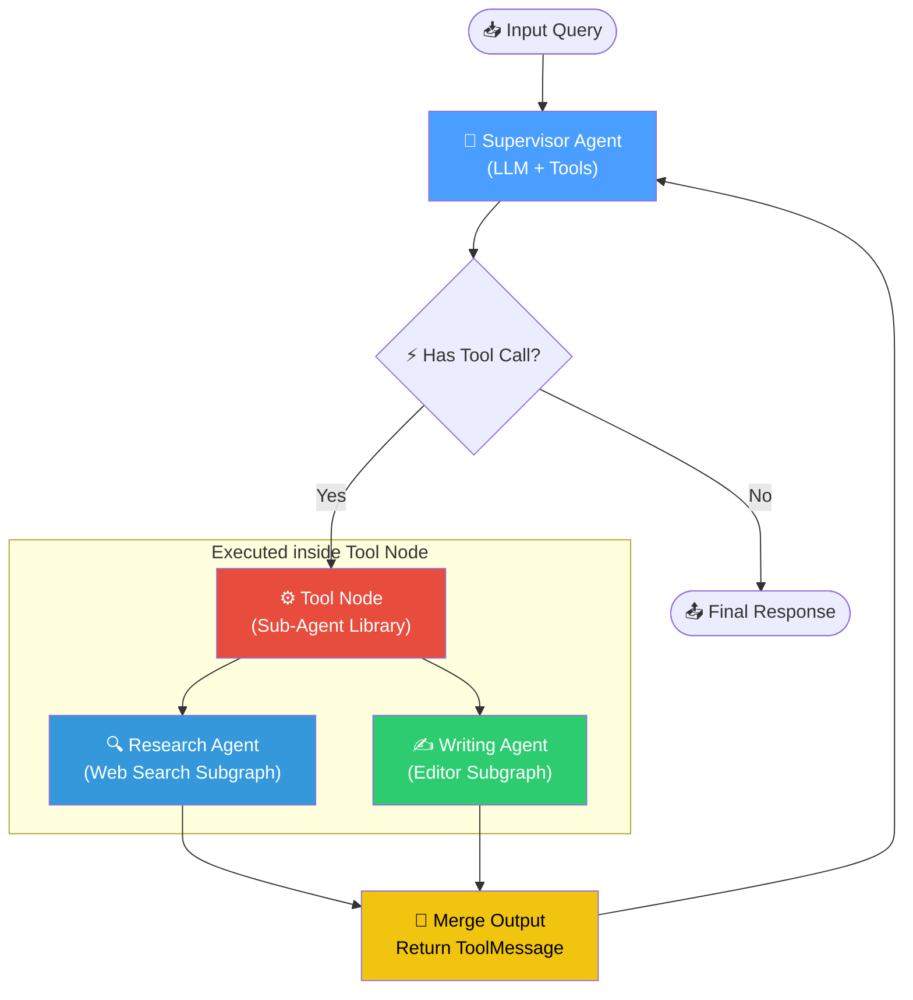
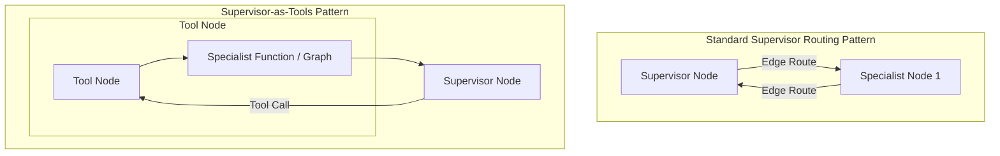

# The Supervisor-as-Tools Pattern — In Depth

## Table of Contents
1. [What Is It?](#what-is-it)
2. [How It Differs From the Standard Supervisor Pattern](#how-it-differs-from-the-standard-supervisor-pattern)
3. [Why Does It Matter?](#why-does-it-matter)
4. [How It Works — Architecture](#how-it-works--architecture)
5. [Comparison With Other Agentic Patterns](#comparison-with-other-agentic-patterns)
6. [Real-World Use Cases](#real-world-use-cases)
7. [Building It From Scratch (LangGraph)](#building-it-from-scratch-langgraph)
8. [Key Takeaways](#key-takeaways)

---

## What Is It?

The **Supervisor-as-Tools** pattern (also known as *Sub-Agents as Tools*) is a multi-agent design pattern where a centralized coordinator agent delegates work to specialized agents by invoking them **directly as tools**. 

Rather than routing control to separate nodes in a graph using conditional edges, the supervisor sees each specialist agent as a function it can call. When the supervisor's LLM determines it needs research, calculations, or writing, it outputs a tool call (e.g. `call_researcher(query="...")`). A tool executor intercepts this call, spins up the specialist agent (which might run its own isolated graph or code), gathers the result, and returns it to the supervisor as a tool message.



---

## How It Differs From the Standard Supervisor Pattern

While both patterns achieve hierarchical delegation, their routing control and state dynamics are fundamentally different.



| Dimension | Standard Supervisor Routing | Supervisor-as-Tools |
| :--- | :--- | :--- |
| **Control Driver** | **Graph Logic**: Managed via conditional edges, routers, or states (`Command(goto="specialist")`). | **LLM Reasoning**: Managed dynamically via tool-calling libraries and execution loops. |
| **Graph Complexity** | **High**: The graph contains separate nodes for every single specialist, leading to star-shaped graphs. | **Low**: The graph only has two main nodes: the `Supervisor` and a generic `ToolNode`. Specialists are hidden inside the tool list. |
| **State sharing** | **Shared**: Often shares a unified conversation history (`MessagesState`) or requires mapping functions to synchronize parent/child states. | **Isolated**: The supervisor passes only explicit arguments to the specialist tool. The specialist's internal search queries or reasoning steps do not bleed into the supervisor's state. |
| **Looping Paradigm** | Transition edges loop control back and forth between nodes (`Supervisor` $\leftrightarrow$ `Specialist`). | Control loops inside a standard ReAct engine (`Agent` $\leftrightarrow$ `ToolNode`). |

---

## Why Does It Matter?

### The Context Bleeding Problem

In a standard routing architecture, if a Supervisor passes control to a Researcher agent, and that Researcher agent conducts 10 web searches and writes 5 summaries, those messages are often appended to the global conversation history. When control returns to the Supervisor:
1. The Supervisor's context window is filled with the researcher's raw search logs.
2. Token costs skyrocket.
3. The supervisor's steering performance degrades due to context noise.

### What Supervisor-as-Tools Solves

- **Strict Context Boundary**: The Specialist runs in its own runtime scope. The only thing returned to the Supervisor is the specialist's final compiled answer, packaged inside a single `ToolMessage`. All intermediate search steps, thoughts, and errors are discarded from the supervisor's history.
- **Architectural Simplification**: Instead of maintaining a complex network topology with 10 different nodes and conditional routing logic, you build a single agent with 10 tools. This is much easier to test, debug, and scale.
- **Natural Tool-Calling Interface**: Modern frontier models (like GPT-4o, Claude Sonnet, and Gemini) are heavily fine-tuned for tool calling. Leveraging this built-in capability for agent delegation is highly reliable compared to prompting them to output next-node routing values.

> [!IMPORTANT]
> The Supervisor-as-Tools pattern is the recommended pattern for **flexible, task-oriented multi-agent systems** where specialized workers need to be invoked iteratively or dynamically based on intermediate outcomes.

---

## How It Works — Architecture

The execution of a Supervisor-as-Tools workflow occurs in a cycle:

1. **User Request**: The user submits a query to the Supervisor (e.g. *"Gather financial metrics on Apple and write a comparative review"*).
2. **Evaluation & Bindings**: The Supervisor LLM has specialist functions bound to its tool-calling list. It evaluates the query and decides to call the research tool.
3. **Execution (The Isolation Layer)**: 
    * The graph routes control to the `ToolNode`.
    * The `ToolNode` invokes `research_sub_agent_tool(query="Apple 2026 financial metrics")`.
    * Inside the tool function, the Research Agent is spun up. It calls web searches, gathers raw pages, and synthesizes a summary.
4. **The Join**: The Research Agent returns only its summary. The tool wrapping function writes this summary as a `ToolMessage` payload.
5. **Evaluation Phase**: The graph returns control to the Supervisor. The Supervisor reviews the research results and decides to call the next tool: `writing_sub_agent_tool(notes="...", format_instructions="..." )`.
6. **Completion**: Once the Writing Agent tool returns the structured document, the Supervisor determines the task is complete and outputs a final, structured response to the user.

---

## Comparison With Other Agentic Patterns

| Pattern | Control Mechanism | Context Scope | Implementation Overhead | Best For |
| :--- | :--- | :--- | :--- | :--- |
| **ReAct (Tool Use)** | LLM calls API tools | Monolithic | Very Low | Querying databases, running math, calling APIs. |
| **Network (Swarm)** | Specialized agents hand off control directly | Dynamic peer-to-peer | Medium | Open-ended collaborative tasks (e.g., Triage -> Tech -> Sales). |
| **Standard Supervisor** | Node-to-node routing via graph edges | Shared/Shared-State | High | Highly structured business workflows with strict routing logic. |
| **Supervisor-as-Tools** | LLM invokes agents as functions | **Strictly isolated** | **Medium** | Systems requiring multiple specialized sub-agents with clean, low-latency contexts. |

---

## Real-World Use Cases

### 1. Enterprise Customer Support Triaging
- **Supervisor**: Receives a customer ticket. It has access to two agent tools: `database_query_agent` and `refund_processing_agent`.
- **Database Query Agent**: Searches internal logs to find customer history.
- **Refund Processing Agent**: Verifies policy details and runs internal calculations.
- **Outcome**: The Supervisor calls the DB agent first, reads the status, realizes the transaction is valid, calls the refund agent, collects the verification code, and writes a professional customer response.

### 2. Autonomous Software Developer
- **Supervisor**: Receives a bug report.
- **Tool 1: Code Search Agent**: Searches the repository for files mentioning the bug.
- **Tool 2: Testing Agent**: Runs the unit tests and reports failures.
- **Tool 3: Writer Agent**: Writes the code patch.
- **Outcome**: The Supervisor calls the search tool, reviews the file paths, asks the test agent to verify, asks the writer tool to apply the patch, and runs the test agent again. All of this happens within a single supervisor reasoning loop.

---

## Building It From Scratch (LangGraph)

Below is the structure of the pattern built in LangGraph.

### State Schema
The state only needs a list of messages. The complexity is pushed into the tool functions:

```python
class SupervisorState(TypedDict):
    # Appends new messages (both AI and Tool messages) automatically
    messages: Annotated[List[BaseMessage], operator.add]
```

### Specialist Definition
Define the Specialist logic as separate python helper functions:

```python
def run_research_agent(query: str) -> str:
    # Spins up internal search tools, loops, compiles results
    search_data = search_tool.invoke(query)
    # Returns final synthesized text string
    return final_summarized_report
```

### Wrapping as a Tool
Wrap the specialist agent inside a LangChain `@tool`:

```python
@tool
def research_sub_agent_tool(query: str) -> str:
    """Delegates a research task to a specialized Research Agent. 
    Use this to look up facts or stock data."""
    return run_research_agent(query)
```

---

## Key Takeaways

> [!IMPORTANT]
>
> ### Summary of the Supervisor-as-Tools Pattern
>
> 1. **What**: A multi-agent structure where specialized workers are wrapped as tools and called directly by a main Supervisor LLM.
> 2. **Why**: Keeps the supervisor's context clean by isolating the worker's intermediate reasoning, simplifying the graph architecture to two main nodes (`supervisor` and `tools`).
> 3. **How**: Binds specialist tool functions to a coordinator LLM and routes through a standard `ToolNode` in LangGraph.
> 4. **When**: Best for dynamic, task-oriented agent hierarchies where tasks can be delegated iteratively.

### Design Principles

- **Expose Clear Tool Descriptions**: The Supervisor decides to call a sub-agent based *entirely* on the tool's docstring and arguments description. Ensure your tools have clean, descriptive docstrings detailing exactly what the specialist does.
- **Model Partitioning**: Use a highly intelligent, expensive reasoning model (e.g. GPT-4o) for the Supervisor so it can organize complex workflows, and use faster, cheaper models (e.g. GPT-4o-mini, Gemini Flash) for the specialists to save operational costs.
- **Maintain Tool Cleanliness**: Ensure that sub-agents return *only* the final synthesized output. Do not return raw logging steps, scratchpads, or intermediate steps back to the supervisor, as this will pollute the main history.

### Common Pitfalls and Solutions

| Pitfall | Technical Symptom | Engineering Solution |
| :--- | :--- | :--- |
| **Tool Selection Paralysis** | The supervisor gets confused and calls multiple tools at once or loops endlessly. | Keep the number of agent tools under ~8. Use highly distinct, descriptive docstrings for each specialist. |
| **Infinite Recursion** | Sub-agent tool A calls sub-agent tool B, which calls sub-agent tool A. | Ensure tools are one-way delegations (Hierarchy). Do not give sub-agents access to tools that can call the supervisor or call each other circularly. |
| **Lost Traceability** | Because sub-agents run inside a generic ToolNode, their intermediate steps do not appear in the parent graph visualization. | Integrate a centralized tracing tool (like LangSmith) to audit the nested tool execution logs. |
