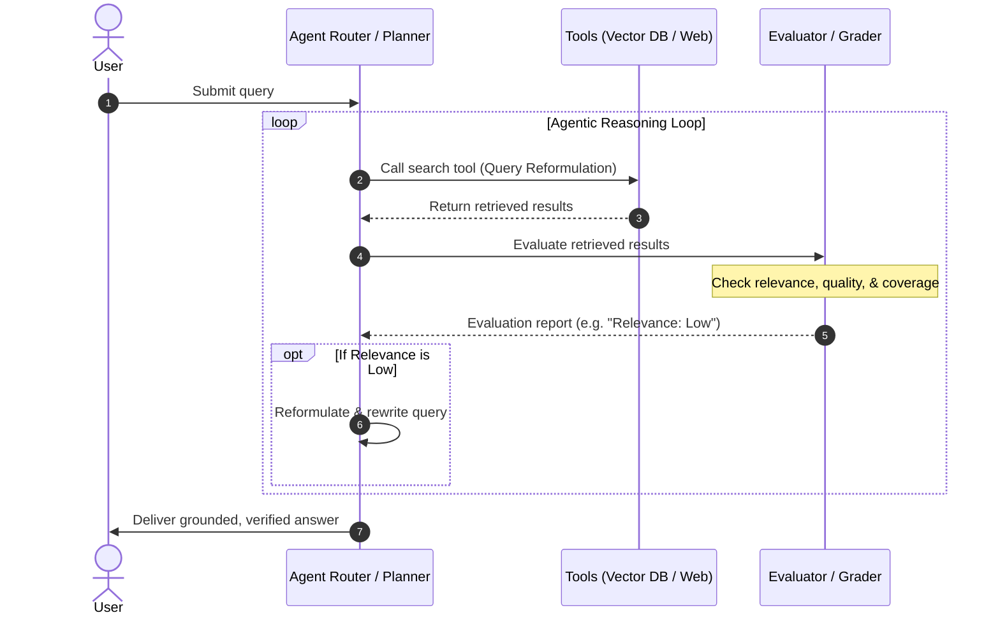
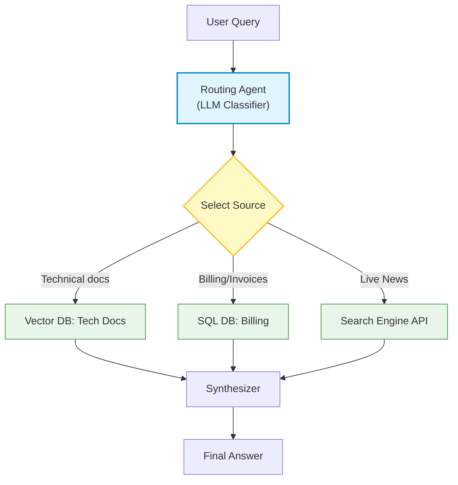
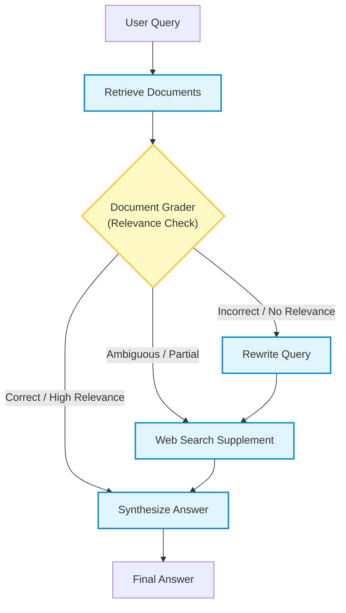
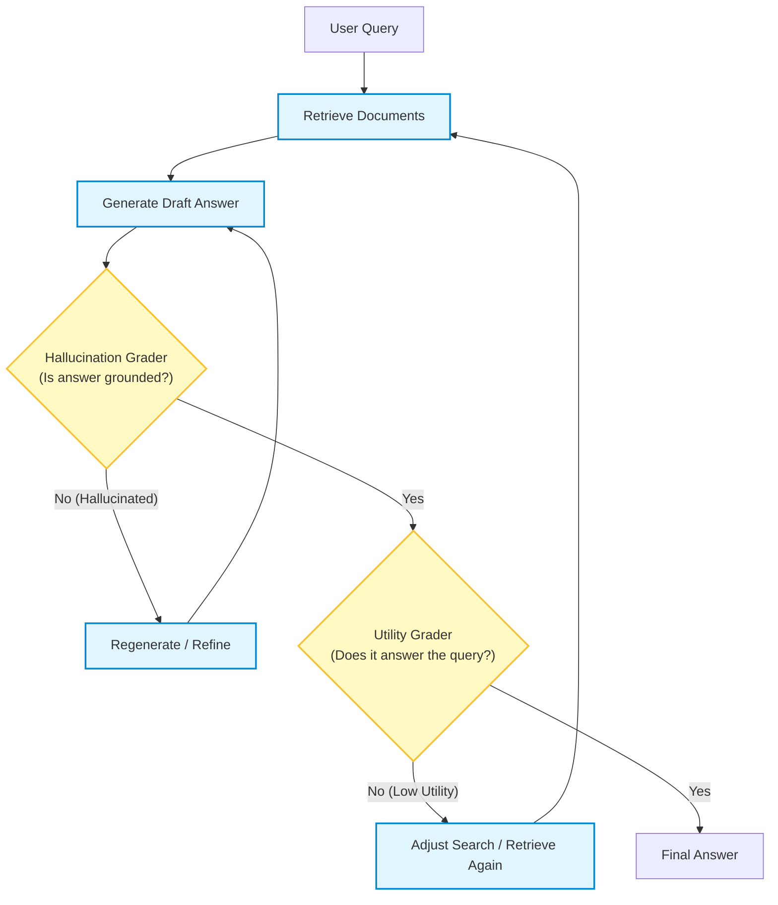
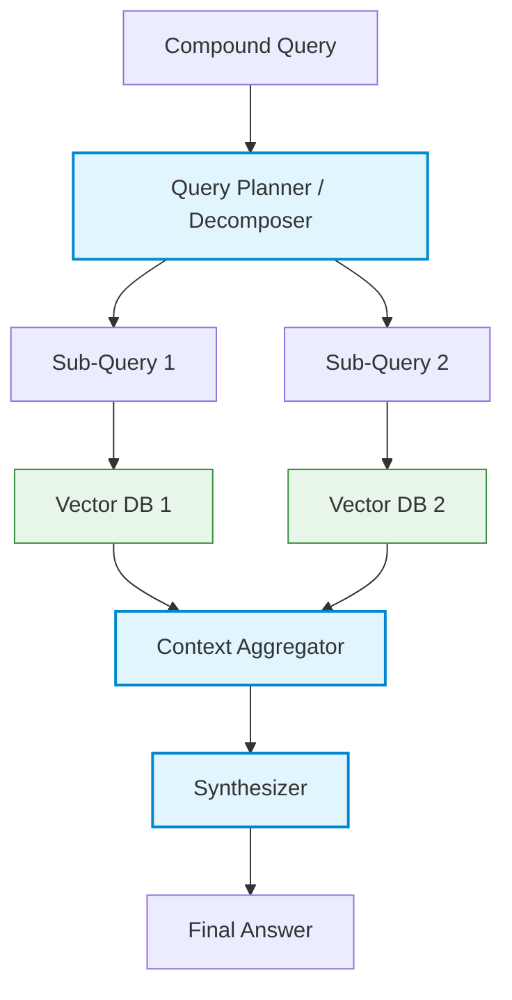

# Pattern #14: Agentic RAG (Single-Agent RAG Paradigm)

## Table of Contents
1. [What is Agentic RAG?](#what-is-agentic-rag)
2. [Why Agentic RAG? (The Core Motivation)](#why-agentic-rag-the-core-motivation)
3. [How Agentic RAG Works: Core Mechanics](#how-agentic-rag-works-core-mechanics)
4. [The Different Paradigms of Agentic RAG](#the-different-paradigms-of-agentic-rag)
   * [Paradigm 1: Routing RAG](#paradigm-1-routing-rag)
   * [Paradigm 2: Corrective RAG (CRAG)](#paradigm-2-corrective-rag-crag)
   * [Paradigm 3: Self-RAG (Reflective RAG)](#paradigm-3-self-rag-reflective-rag)
   * [Paradigm 4: Sub-Query Decomposition & Query Planning](#paradigm-4-sub-query-decomposition--query-planning)
5. [Comparison of Paradigms](#comparison-of-paradigms)
6. [Pros & Cons of Agentic RAG](#pros--cons-of-agentic-rag)
7. [Architectural Outline in LangGraph](#architectural-outline-in-langgraph)

---

## What is Agentic RAG?

**Agentic Retrieval-Augmented Generation (Agentic RAG)** represents a major evolution from passive, linear RAG systems to active, agentic loops. 

In standard (Naive) RAG, the workflow is entirely rigid and linear: the system takes a user's query, fetches matching vector chunks, passes them directly to an LLM, and prints the result. 

In **Agentic RAG**, the retrieval and synthesis stages are orchestrated by an LLM-based agent. The agent treats vector stores, document repositories, web search engines, and query rewriters as **tools**. Operating in an iterative loop (often using state machines or ReAct patterns), the agent evaluates the relevance of retrieved documents, rewrites queries if search results are poor, falls back to web searches, and double-checks its answers for hallucinations before presenting them to the user.

> [!NOTE]
> Agentic RAG shifts the LLM from being a **passive synthesizer** of pre-fetched context to an **active director** of the entire information assembly line.

---

## Why Agentic RAG? (The Core Motivation)

Standard RAG systems are prone to several distinct failure modes that make them unsuitable for complex enterprise applications:

1. **Retrieval Noise & Irrelevance**: If a vector search retrieves irrelevant chunks, standard RAG still forces the LLM to synthesize an answer, leading to confusing outputs or subtle hallucinations.
2. **Missing Information**: If the vector database lacks the answers, standard RAG cannot look elsewhere. It either fails silently or outputs confident, incorrect statements.
3. **Ambiguous Queries**: Users often write poorly formatted queries. Standard RAG searches for the exact query literally, whereas an agent can reformulate it for better vector match performance.
4. **Multi-Step & Complex Reasoning**: Queries like *"Did our profit margins increase faster than our primary competitor's in Q3 2024?"* require breaking down the query, searching two separate reports, performing math, and comparing. Naive RAG attempts this in one single lookup, which fails.

### Naive RAG vs. Agentic RAG Comparison

```mermaid
flowchart TD
    subgraph Naive["Naive RAG (Static & Rigid)"]
        Q1["User Query"] --> R1["Retrieve (Vector Search)"]
        R1 --> S1["Synthesize (LLM)"]
        S1 --> A1["Final Answer"]
    end

    subgraph Agentic["Agentic RAG (Dynamic & Iterative)"]
        Q2["User Query"] --> Router["Agent Router/Planner"]
        Router --> Route{"Decision"}
        
        Route -- "Vector Search" --> Retriever["Retriever Tool"]
        Route -- "Web Search" --> WebSearch["Web Search Tool"]
        Route -- "Direct Response" --> Gen["Direct Response"]
        
        Retriever --> Grader{"Document Grader"}
        WebSearch --> Grader
        
        Grader -- "Irrelevant Context" --> Rewriter["Query Rewriter Node"]
        Rewriter --> Router
        
        Grader -- "Relevant Context" --> Generator["Response Generator"]
        
        Generator --> SelfCritic{"Self-Critic / Hallucination Grader"}
        SelfCritic -- "Hallucinated or Incomplete" --> Refiner["Response Refiner"]
        Refiner --> Router
        
        SelfCritic -- "Grounded & Complete" --> A2["Final Synthesized Answer"]
    end

    classDef naive fill:#eceff1,stroke:#607d8b,stroke-width:2px;
    classDef agentic fill:#e1f5fe,stroke:#0288d1,stroke-width:2px;
    classDef tool fill:#e8f5e9,stroke:#388e3c,stroke-width:1px;
    classDef eval fill:#fff9c4,stroke:#fbc02d,stroke-width:2px;
    
    class Q1,R1,S1,A1 naive;
    class Q2,Router,Generator,Refiner,A2 agentic;
    class Retriever,WebSearch,Rewriter tool;
    class Route,Grader,SelfCritic eval;
```



---

## How Agentic RAG Works: Core Mechanics

An Agentic RAG architecture operates under a continuous cycle of execution, reflection, and adjustment:



1. **Planning & Routing**: The agent decides if it needs to query external databases, use a vector store, or reply directly.
2. **Dynamic Tool Execution**: The agent calls retrieval tools. Instead of using static parameters, the agent dynamically decides search weights, top-k values, and namespaces.
3. **Self-Grading & Evaluation**: Retrieved chunks are graded by a classifier (LLM or cross-encoder). Irrelevant chunks are discarded.
4. **Correction & Iteration**: If the context retrieved is insufficient, the agent invokes a query-rewriter to reformulate the search term and queries the database (or a fallback like Google/Tavily search) again.
5. **Synthesis & Auditing**: The final response is cross-checked against the retrieved source documents to ensure zero-hallucination compliance.

---

## The Different Paradigms of Agentic RAG

---

### Paradigm 1: Routing RAG

In **Routing RAG**, the agent serves as an intelligent switchboard. It classifies the incoming query and redirects it to the most appropriate knowledge source. This is essential when working with heterogeneous data sources.



> [!TIP]
> **Use Case**: Customer service systems that need to search technical manuals, parse billing databases via SQL, or look up live order statuses.

---

### Paradigm 2: Corrective RAG (CRAG)

**Corrective RAG (CRAG)** adds a self-correction mechanism to retrieval. It uses a lightweight document grader to evaluate retrieved documents. If the relevance is high, it proceeds. If it is low or ambiguous, it triggers query rewriting and pulls in external web search APIs to supplement the missing knowledge.



> [!WARNING]
> CRAG prevents the model from generating answers when retrieval returns irrelevant noise, correcting the query on the fly to get better results.

---

### Paradigm 3: Self-RAG (Reflective RAG)

**Self-RAG** utilizes reflection tokens and self-grading nodes to optimize both retrieval and generation. Instead of just grading the inputs, it grades the generated draft answer across three axes:
1. **Is retrieval necessary?** (Retrieval reflection)
2. **Are the retrieved sources relevant?** (Relevance reflection)
3. **Is the draft answer fully grounded in the retrieved sources?** (Hallucination check)
4. **Does the final answer utility score meet the threshold?** (Utility check)



---

### Paradigm 4: Sub-Query Decomposition & Query Planning

When a user submits a compound query, the agent acts as a planner. It decomposes the complex query into sequential or parallel sub-queries, dispatches them to different retrieval tools, and combines the results.



---

## Comparison of Paradigms

| Feature | Routing RAG | Corrective RAG (CRAG) | Self-RAG | Sub-Query Decomposition |
| :--- | :--- | :--- | :--- | :--- |
| **Logic Type** | Classification / Routing | Validation & Correction | Self-Reflection & Auditing | Planning & Decomposition |
| **Ideal Use Case** | Multiple distinct datastores | Document retrieval with noise | High-accuracy factual tasks | Comparative, compound queries |
| **Latency** | ⚡ **Low** (Single classification) | ⏱️ **Medium** (Conditional loop) | 🐢 **High** (Self-reflective loops) | ⏱️ **Medium** (Parallel execution) |
| **Self-Correction**| None | Yes (Web search / Rewrite fallback) | Yes (Hallucination grading & regeneration) | None |
| **Complexity** | Easy | Medium | Hard | Medium |

---

## Pros & Cons of Agentic RAG

### Pros
* **Substantial Reduction in Hallucinations**: Answers are strictly validated against retrieved content before completion.
* **Resiliency**: If a database fails to yield relevant documents, fallback mechanisms (like web searches) kick in automatically.
* **Handling Complex Queries**: Naturally breaks down and solves complex, multi-hop reasoning tasks.
* **Higher Precision**: Dynamic search reformulation retrieves far higher-quality vector embeddings.

### Cons
* **Increased Latency**: Running loops of retrieval, grading, and query rewriting is significantly slower than standard RAG.
* **High Token Cost**: Multiple agent cycles, reflection steps, and LLM-based grading nodes consume large amounts of input/output tokens.
* **Complexity & Debugging**: Harder to test and debug because of non-deterministic routing pathways.
* **Infinite Loops**: Without hard thresholds (like `max_loops = 3`), agents can get stuck in infinite query rewriting loops.

---

## Architectural Outline in LangGraph

Here is how you define an Agentic RAG workflow (using the CRAG pattern) in LangGraph:

```python
from typing import List, Dict, Literal
from pydantic import BaseModel
from langgraph.graph import StateGraph, START, END

# 1. State Definition
class RAGState(BaseModel):
    query: str
    documents: List[str]
    rewritten_query: str
    needs_web_search: bool
    draft_answer: str

# 2. Define Nodes
def retrieve_docs(state: RAGState) -> Dict:
    # Query Vector Store
    docs = vector_store.retrieve(state.query)
    return {"documents": docs}

def grade_documents(state: RAGState) -> Dict:
    # Check relevance of documents
    for doc in state.documents:
        score = relevance_grader.invoke({"document": doc, "query": state.query})
        if score.relevance == "low":
            return {"needs_web_search": True}
    return {"needs_web_search": False}

def rewrite_query(state: RAGState) -> Dict:
    # Reformulate query to make it better for web search
    new_query = query_rewriter.invoke({"query": state.query})
    return {"rewritten_query": new_query}

def web_search(state: RAGState) -> Dict:
    # Fallback web search
    web_results = web_search_tool.search(state.rewritten_query)
    return {"documents": state.documents + web_results}

def generate_answer(state: RAGState) -> Dict:
    # Generate final grounded answer
    ans = generator.invoke({"query": state.query, "context": state.documents})
    return {"draft_answer": ans}

# 3. Router logic
def route_relevance(state: RAGState) -> Literal["rewrite_query", "generate_answer"]:
    if state.needs_web_search:
        return "rewrite_query"
    return "generate_answer"

# 4. Build Graph
workflow = StateGraph(RAGState)

workflow.add_node("retrieve_docs", retrieve_docs)
workflow.add_node("grade_documents", grade_documents)
workflow.add_node("rewrite_query", rewrite_query)
workflow.add_node("web_search", web_search)
workflow.add_node("generate_answer", generate_answer)

workflow.add_edge(START, "retrieve_docs")
workflow.add_edge("retrieve_docs", "grade_documents")
workflow.add_conditional_edges("grade_documents", route_relevance)
workflow.add_edge("rewrite_query", "web_search")
workflow.add_edge("web_search", "generate_answer")
workflow.add_edge("generate_answer", END)

app = workflow.compile()
```
