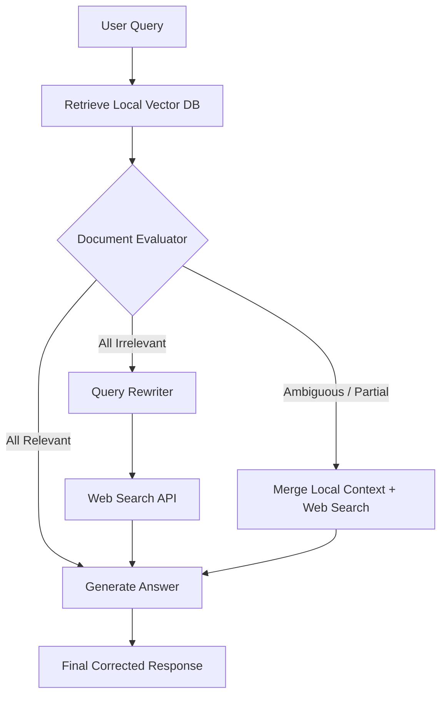
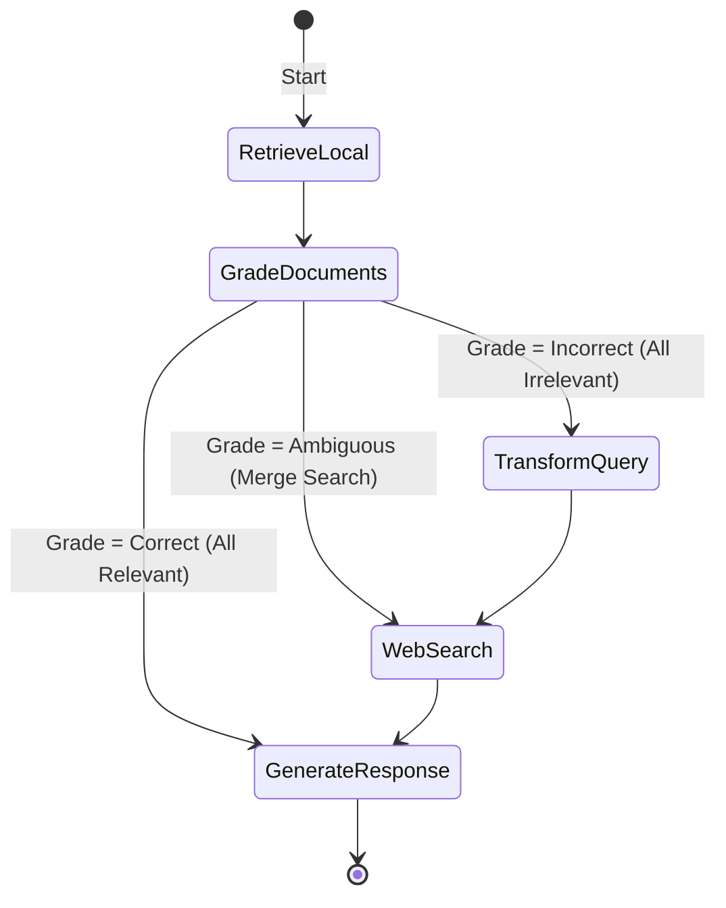

# Corrective RAG (Corrective Retrieval-Augmented Generation)

## Table of Contents
1. [What is Corrective RAG?](#what-is-corrective-rag)
2. [Why, When, and How to Use It](#why-when-and-how-to-use-it)
3. [Flowchart & State Machine](#flowchart--state-machine)
4. [Pros and Cons](#pros-and-cons)
5. [Real-World Case Study: Out-of-Distribution Product FAQ Support](#real-world-case-study-out-of-distribution-product-faq-support)
6. [Building from Scratch in LangGraph](#building-from-scratch-in-langgraph)

---

## What is Corrective RAG?

**Corrective RAG (CRAG)** is a RAG design pattern introduced to handle inaccurate or irrelevant document retrieval. Instead of blindly passing retrieved documents to the generator, CRAG inserts a **Document Evaluator** (a grading step) between retrieval and generation. 

Based on the evaluation of the retrieved documents, the system takes corrective actions:
- **Correct (Relevant)**: If the documents are highly relevant, the system directly proceeds to generation.
- **Incorrect (Irrelevant)**: If the documents are completely irrelevant, the system discards them, reformulates the user query, and retrieves from an external source (like a Web Search API).
- **Ambiguous (Partially Relevant)**: If the documents are partially relevant, the system combines the local documents with external web search results to ensure complete coverage before generating.

---

## Why, When, and How to Use It

### Why Use Corrective RAG?
Standard RAG systems fail when the local vector database contains stale, incomplete, or irrelevant information. The LLM is forced to generate an answer using bad context, which inevitably causes hallucinations or unhelpful "I don't know" responses. CRAG solves this by actively grading documents and leveraging backup search tools to "correct" the context.

### When to Use It
- **Rapidly Evolving Knowledge Bases**: Where internal company documentation might lag behind actual system status or news.
- **Out-of-Distribution Queries**: When users ask questions that are tangential to the core document index, requiring an external search fallback.
- **Accuracy-Critical Support Desk**: Where providing outdated product information directly harms user trust.

### How it Works
1. **Retrieve**: Pull document candidates from the local vector database.
2. **Evaluate/Grade**: Evaluate the quality and relevance of each document against the query.
3. **Branching Decision**:
   - Relevant -> Send straight to the generator.
   - Irrelevant / Ambiguous -> Route to Query Rewriter -> Trigger External Web Search.
4. **Context Merging**: Combine valid local files with web search results.
5. **Generate**: Synthesize the final, verified answer.

---

## Flowchart & State Machine

### High-Level CRAG Flowchart

### Detailed LangGraph State Machine

---

## Pros and Cons

### Pros
- **Hallucination Reducer**: Prevents the generator from utilizing misleading or out-of-context documents.
- **Automated Fallback**: Seamlessly bridges the gap between private internal documents and the public web.
- **Self-Correction**: Dynamically alters the query to improve web search relevance when local index match fails.

### Cons
- **Higher Latency**: The grading step and external search api call add time to the processing pipeline.
- **External Dependency Risk**: Relying on web search engines introduces rates, keys, and uptime dependencies.
- **Token Inflation**: Re-running queries and passing multiple sets of documents consumes more LLM tokens.

---

## Real-World Case Study: Out-of-Distribution Product FAQ Support

### Scenario
An electronics manufacturer, **ElectroNova**, sells smart IoT plugs. 
- The local vector DB contains specifications for their existing plugs (SmartPlug v1, SmartPlug v2).
- A customer submits a query about a newly announced prototype, **SmartPlug Pro**, which hasn't been added to the internal manuals database yet.
- Without CRAG, the retriever returns manuals for SmartPlug v2. The generator incorrectly answers using v2 stats, leading to false information.
- With CRAG, the document grader flags the v2 manuals as irrelevant to "SmartPlug Pro". The system rewrites the query to "ElectroNova SmartPlug Pro specifications", searches the web, retrieves the recent press release, and gives the correct answer.

---

## Building from Scratch in LangGraph

The LangGraph implementation features a document grading node using structured JSON output, a query-transformation node, a web search execution node, and conditional routing based on grading results. Explore the complete python file to see how these elements combine in code.
