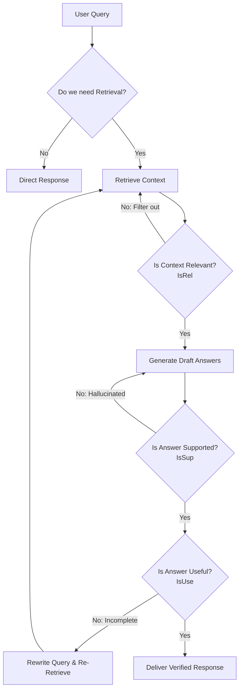
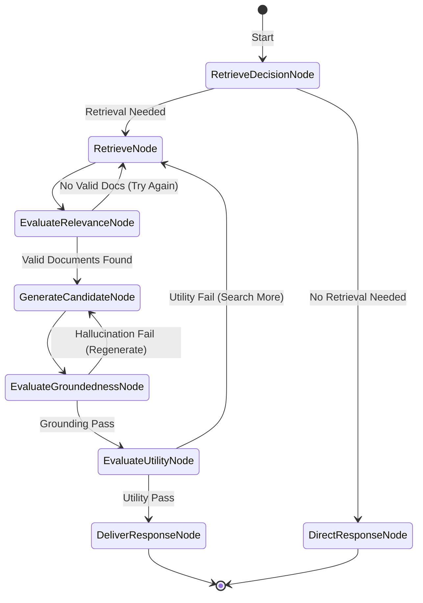

# Self-RAG (Self-Reflective Retrieval-Augmented Generation)

## Table of Contents
1. [What is Self-RAG?](#what-is-self-rag)
2. [Why, When, and How to Use It](#why-when-and-how-to-use-it)
3. [Flowchart & State Machine](#flowchart--state-machine)
4. [Pros and Cons](#pros-and-cons)
5. [Real-World Case Study: Automated Financial Report Audit](#real-world-case-study-automated-financial-report-audit)
6. [Building from Scratch in LangGraph](#building-from-scratch-in-langgraph)

---

## What is Self-RAG?

**Self-RAG (Self-Reflective Retrieval-Augmented Generation)** is an agentic RAG framework that trains or prompts the LLM to output specialized **reflection/critic tokens** alongside its text generation. These tokens critique both the retrieval decision and the generated text. 

Self-RAG breaks the RAG pipeline into three distinct, self-evaluated axes:
1. **Retrieve Decision**: Does the query actually need external retrieval? (Adaptive retrieval trigger).
2. **Relevance (`IsRel`)**: Is the retrieved context relevant to the query?
3. **Supported (`IsSup`)**: Is the drafted response completely supported by the retrieved context (checking for hallucination)?
4. **Useful (`IsUse`)**: Is the response helpful and complete in directly addressing the query?

By executing these checks iteratively, Self-RAG acts as its own editor, discarding low-quality documents, rewriting drafts, and refining the output before finalizing.

---

## Why, When, and How to Use It

### Why Use Self-RAG?
Standard RAG assumes that if you retrieve documents, they will automatically be helpful and the LLM will output a correct response. In reality:
- LLMs often hallucinate details that are not in the context.
- LLMs sometimes generate generic answers that ignore specific questions.
Self-RAG builds a multi-dimensional critique layer directly into the response formulation, enforcing alignment and utility.

### When to Use It
- **Compliance & Legal Auditing**: Where every statement in a report must be backed by a clear citation (highly grounded).
- **Medical Information Systems**: Where inaccuracies, even minor ones, can have severe consequences.
- **Complex Financial Analytics**: Where synthesis of conflicting metrics from different balance sheets requires rigorous checking.

### How it Works
1. **Assess Retrieval**: Determine if retrieval is needed. If yes, retrieve documents.
2. **Critique Relevance (`IsRel`)**: Evaluate document relevance. Retain only relevant chunks.
3. **Generate Candidates**: Draft candidate answer snippets based on the relevant context.
4. **Critique Support (`IsSup`)**: Grade the candidate to ensure all statements are grounded in the context.
5. **Critique Utility (`IsUse`)**: Grade the candidate for complete usefulness.
6. **Iterate or Select**: If candidate scores are low, refine or regenerate. Choose the candidate with the highest overall score.

---

## Flowchart & State Machine

### High-Level Self-RAG Flowchart

### Detailed LangGraph State Machine

---

## Pros and Cons

### Pros
- **Fine-Grained Critique**: Separates document grading, hallucination detection, and completeness checks into distinct evaluative steps.
- **Explainability**: The state logs show exactly why a document was rejected, or why an answer was sent back for revision.
- **High Output Fidelity**: Drastically lowers hallucination rates in highly dense factual settings.

### Cons
- **Heavy LLM Overhead**: Running three separate critique checks can significantly increase token consumption.
- **Complex Loop Paths**: Loops can be difficult to exit if retrieved documents are consistently borderline.
- **High Latency**: Not suitable for real-time chat interfaces where low time-to-first-token is critical.

---

## Real-World Case Study: Automated Financial Report Audit

### Scenario
A hedge fund analyst wants to build an auditor that reads internal quarterly reports and synthesizes an investment summary.
- The auditor must verify every single claim (e.g. "We grew Q3 revenue by 14%") against the actual balance sheet documents.
- If it writes a summary and claims that "Operating expenses decreased by $5M," but the balance sheet shows expenses actually increased, the **Groundedness (`IsSup`)** check must catch this hallucination and trigger a rewrite.
- If it writes a summary that is too short and misses key risks mentioned in the files, the **Utility (`IsUse`)** check must flag it as incomplete and instruct the agent to fetch the risk section.

---

## Building from Scratch in LangGraph

The LangGraph implementation builds a structured Self-RAG loop. We define states for our documents, critiques (`IsRel`, `IsSup`, `IsUse`), candidate answers, and loop counts. Using structured Pydantic objects, our evaluator nodes score the state, and conditional router edges direct execution to either refine, re-retrieve, or finish. See the python script for the full implementation.
