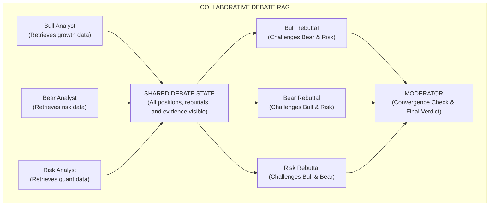
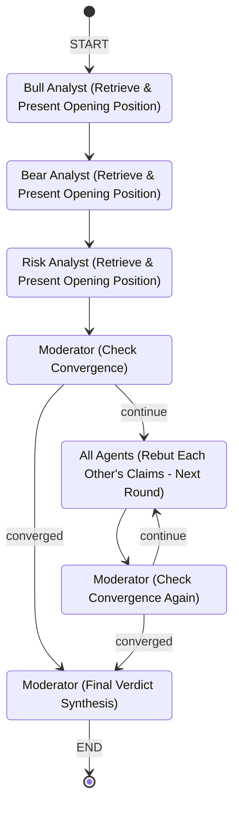

# Collaborative / Debate RAG (Multi-Agent RAG Paradigm)

## Table of Contents
1. [What is Collaborative / Debate RAG?](#what-is-collaborative--debate-rag)
2. [How It Works - The Complete Process](#how-it-works---the-complete-process)
3. [Full Workflow Diagram](#full-workflow-diagram)
4. [Why and When to Use It](#why-and-when-to-use-it)
5. [Pros and Cons](#pros-and-cons)
6. [Building from Scratch in LangGraph](#building-from-scratch-in-langgraph)
7. [Real-World Case Study: Investment Committee Debate](#real-world-case-study-investment-committee-debate)

---

## What is Collaborative / Debate RAG?

**Collaborative / Debate RAG** is a multi-agent RAG paradigm where multiple specialized agents independently retrieve evidence from knowledge bases, then engage in **structured adversarial debate rounds** to stress-test, critique, and refine each other's findings before converging on a high-quality consensus answer.

### The Core Insight

Most RAG systems have a single retriever and a single generator. This creates a dangerous single-point-of-failure: if the retrieval is poor or the LLM hallucinates, there is no check. Collaborative Debate RAG solves this by introducing **cognitive diversity** — multiple agents with different analytical lenses independently gather evidence, then argue their positions in rounds. A neutral **Moderator** synthesizes the debate into a balanced final verdict.

Think of it like a **courtroom trial** or a **corporate board meeting**:
- The **Prosecution** (Bear Analyst) retrieves evidence of risk and argues against.
- The **Defense** (Bull Analyst) retrieves evidence of opportunity and argues for.
- The **Expert Witness** (Risk Analyst) retrieves regulatory/quantitative evidence and provides neutral context.
- The **Judge** (Moderator) listens to all rounds and delivers a balanced ruling.

### Key Terminology

| Term | Definition |
|------|-----------|
| **Debate Agent** | A specialized agent with a defined analytical perspective (e.g., bullish, bearish, risk-focused) |
| **Position Statement** | An agent's initial evidence-backed argument retrieved from its knowledge base |
| **Rebuttal** | A counter-argument where an agent challenges another agent's position using its own evidence |
| **Debate Round** | One full cycle where all agents present positions or rebuttals |
| **Convergence** | The point where agents' positions stabilize and no new substantive arguments emerge |
| **Moderator** | A neutral orchestrator agent that tracks the debate, checks for convergence, and synthesizes the final verdict |
| **Consensus Score** | A quantitative measure of how much the agents agree (used to determine when to stop debating) |

### How It Differs from Other Multi-Agent RAG Paradigms

| Feature | Hierarchical RAG | Sequential Multi-Hop RAG | Collaborative Debate RAG |
|---------|------------------|--------------------------|--------------------------|
| **Agent Relationship** | Boss -> Workers (top-down) | Analyst -> Executor (sequential loop) | Peers + Moderator (adversarial) |
| **Retrieval Pattern** | Parallel, independent | Sequential, dependent | Parallel, then adversarial cross-examination |
| **Key Mechanism** | Task decomposition & delegation | Bridge entities chain hops | Argumentation, rebuttal, convergence |
| **Failure Mode** | Worker returns bad data, boss trusts it | Wrong hop cascades errors | Debate catches errors via adversarial challenge |
| **Best For** | Multi-domain audits (breadth) | Chain-of-evidence (depth) | Contested decisions requiring balanced judgment |
| **Output Quality** | Good (parallel coverage) | Good (deep tracing) | Highest (adversarially stress-tested) |

---

## How It Works - The Complete Process

### Phase 1: Evidence Retrieval (Independent)

Each debate agent independently queries its own knowledge base to build its initial position. This is critical — agents must form opinions BEFORE seeing others' arguments, preventing groupthink.

```
User Question: "Should we invest $50M in QuantumTech Inc.?"

Bull Analyst  --> Queries Growth & Opportunity DB --> "Revenue up 28%, strong patent portfolio..."
Bear Analyst  --> Queries Risk & Liability DB     --> "FTC antitrust probe, sole-source dependency..."
Risk Analyst  --> Queries Regulatory & Quant DB   --> "Debt-to-equity 0.27, but ITAR compliance gaps..."
```

### Phase 2: Opening Statements (Round 1)

Each agent presents its evidence-backed position statement to the shared debate state. All agents can now see each other's arguments.

### Phase 3: Rebuttal Rounds (Rounds 2-N)

This is the core of the paradigm. In each round:

1. Each agent **reads the other agents' latest arguments**.
2. Each agent **challenges specific claims** using its own retrieved evidence.
3. Each agent **refines its own position** based on valid counter-arguments it received.
4. The **Moderator evaluates convergence** — are agents still introducing new substantive arguments, or are positions stabilizing?

Example rebuttal chain:
```
Bull: "Revenue grew 28% YoY — strong growth trajectory."
Bear: "But R&D spend is $52M against $38M EBITDA. They're burning cash to grow. Unsustainable."
Bull: "Fair point on burn rate, but their SaaS gross margin is 64.2% — unit economics are healthy."
Risk: "Both points valid. However, the FTC antitrust probe introduces regulatory uncertainty
       that could delay the CryoSystems acquisition, which is their key growth catalyst."
```

### Phase 4: Convergence Check

After each round, the Moderator analyzes whether:
- Agents are repeating arguments (convergence reached)
- All key dimensions have been covered
- The maximum number of rounds has been reached

### Phase 5: Final Verdict Synthesis

The Moderator compiles the full debate transcript into a structured verdict that:
- Summarizes each agent's strongest arguments
- Identifies points of agreement and disagreement
- Delivers a balanced, evidence-backed recommendation
- Assigns a confidence level to the final decision

---

## Full Workflow Diagram

### High-Level Architecture



### Detailed State Machine



---

## Why and When to Use It

### When to Use Collaborative Debate RAG

1. **High-Stakes Decisions**: Investment decisions, medical diagnoses, legal judgments where a single perspective is dangerous.
2. **Contested or Ambiguous Questions**: Questions where reasonable people could disagree (e.g., "Is this acquisition a good idea?").
3. **Bias Mitigation**: When you need to actively counteract confirmation bias in retrieval and generation.
4. **Multi-Perspective Analysis**: Scenarios requiring explicit consideration of pros, cons, and risk factors.
5. **Regulatory / Compliance Reviews**: Where you must demonstrate that multiple angles were considered before a decision.

### When NOT to Use It

- **Simple factual lookups**: "What is the capital of France?" does not need a debate.
- **Undisputed, objective queries**: Questions with a single clear answer.
- **Latency-critical applications**: Multiple debate rounds add significant time.
- **Small knowledge bases**: Debate is only valuable when agents can retrieve genuinely different evidence.

---

## Pros and Cons

### Pros

| Advantage | Description |
|-----------|-------------|
| **Adversarial Error Correction** | Agents actively challenge each other's claims, catching hallucinations and retrieval errors |
| **Reduced Confirmation Bias** | Forcing opposing perspectives prevents the system from cherry-picking supporting evidence |
| **Higher Output Quality** | Final answers are stress-tested through multiple rounds of scrutiny |
| **Auditable Reasoning** | Full debate transcript provides a rich audit trail of how the decision was reached |
| **Cognitive Diversity** | Different analytical lenses (bull/bear/risk) ensure comprehensive coverage |
| **Graceful Uncertainty** | The system naturally expresses uncertainty when agents genuinely disagree |

### Cons

| Disadvantage | Description |
|--------------|-------------|
| **Highest Latency** | Multiple debate rounds with multiple agents is the slowest RAG paradigm |
| **Highest Token Cost** | Each agent makes multiple LLM calls per round, multiplied by number of rounds |
| **Complexity** | Most complex to implement — requires careful prompt engineering for each agent's persona |
| **Artificial Disagreement** | Agents may manufacture disagreements to "fill their role" even when evidence clearly supports one side |
| **Convergence Difficulty** | LLM-based agents may struggle to converge, requiring hard round limits |
| **Diminishing Returns** | After 2-3 rounds, additional debate rounds rarely produce new insights |

---

## Building from Scratch in LangGraph

### Step 1: Define the Debate State

```python
class DebateState(MessagesState):
    current_round: int           # Which debate round we are in
    max_rounds: int              # Maximum debate rounds allowed
    bull_position: str           # Bull analyst's current position
    bear_position: str           # Bear analyst's current position
    risk_position: str           # Risk analyst's current position
    debate_history: list[str]    # Full transcript of all rounds
    next_step: str               # "debate" or "verdict"
    final_verdict: str           # Moderator's final synthesis
```

### Step 2: Build Agent Nodes with Personas

Each agent has a defined analytical lens:

```python
def bull_analyst(state):
    """Retrieves and argues the BULLISH case — growth, opportunity, upside."""
    evidence = query_growth_database(state)
    other_positions = get_other_positions(state)
    
    if state["current_round"] == 1:
        position = llm.invoke("Present your BULLISH opening position based on: " + evidence)
    else:
        position = llm.invoke("REBUT the bear/risk arguments and strengthen your case: " + other_positions)
    
    return {"bull_position": position, "debate_history": [...updated]}
```

### Step 3: Build the Moderator with Convergence Detection

```python
def moderator(state):
    """Evaluates debate progress and decides whether to continue or deliver verdict."""
    decision = structured_llm.invoke(
        "Review the debate transcript. Are agents still making NEW substantive arguments? "
        "Or have positions stabilized? Decide: 'debate' (continue) or 'verdict' (synthesize)."
    )
    return {"next_step": decision.next_step}
```

### Step 4: Assemble the Graph

```python
graph = StateGraph(DebateState)
graph.add_node("bull_analyst", bull_analyst)
graph.add_node("bear_analyst", bear_analyst)
graph.add_node("risk_analyst", risk_analyst)
graph.add_node("moderator", moderator)
graph.add_node("verdict", final_verdict)

graph.add_edge(START, "bull_analyst")
graph.add_edge("bull_analyst", "bear_analyst")
graph.add_edge("bear_analyst", "risk_analyst")
graph.add_edge("risk_analyst", "moderator")
graph.add_conditional_edges("moderator", route_debate, {"debate": "bull_analyst", "verdict": "verdict"})
graph.add_edge("verdict", END)
```

---

## Real-World Case Study: Investment Committee Debate

### Scenario

A private equity fund, **Apex Capital Partners**, is evaluating a **$50 Million growth equity investment** in **QuantumTech Inc.**, a quantum computing startup. The fund's Investment Committee requires a structured adversarial review before any capital deployment.

### The Question

> "Should Apex Capital Partners invest $50M in QuantumTech Inc.'s Series C? Evaluate the growth opportunity, downside risks, and regulatory/quantitative risk factors. Provide a final investment recommendation."

### The Three Debate Agents

| Agent | Perspective | Knowledge Base | Goal |
|-------|------------|----------------|------|
| **Bull Analyst** | Optimistic / Growth | Revenue data, market size, patent portfolio, competitive moats | Argue FOR the investment |
| **Bear Analyst** | Pessimistic / Risk | Litigation, customer concentration, burn rate, competitive threats | Argue AGAINST the investment |
| **Risk Analyst** | Neutral / Quantitative | Regulatory filings, debt ratios, ITAR compliance, sanctions exposure | Provide unbiased risk metrics |

### Expected Debate Flow

```
Round 1 (Opening Statements):
  Bull: "28% revenue growth, 64% gross margins, 2 granted patents in silicon photonics..."
  Bear: "FTC antitrust probe, sole-source supplier dependency, $52M R&D burn..."
  Risk: "Debt-to-equity 0.27 (healthy), but ITAR compliance gaps and sanctions exposure via CryoSystems..."

Round 2 (Rebuttals):
  Bull: "The R&D burn is justified — they're building a patent moat. SaaS margins prove unit economics."
  Bear: "But the FTC probe could block their CryoSystems acquisition — their ENTIRE growth catalyst."
  Risk: "The CryoSystems parent company is OFAC-sanctioned. This creates ITAR supply chain risk."

Round 3 (Convergence):
  Bull: "I concede the CryoSystems risk. But the core technology is valuable even without that deal."
  Bear: "I concede strong margins. But without CryoSystems, their hardware roadmap stalls."
  Risk: "Both valid. Net risk: MEDIUM-HIGH. Investment viable with pre-closing conditions."

Moderator Verdict: CONDITIONAL INVEST with risk mitigation requirements.
```

### Implementation

The complete LangGraph implementation follows in the accompanying Python file.
