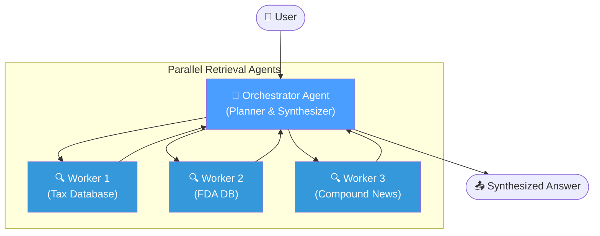
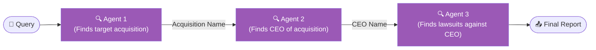
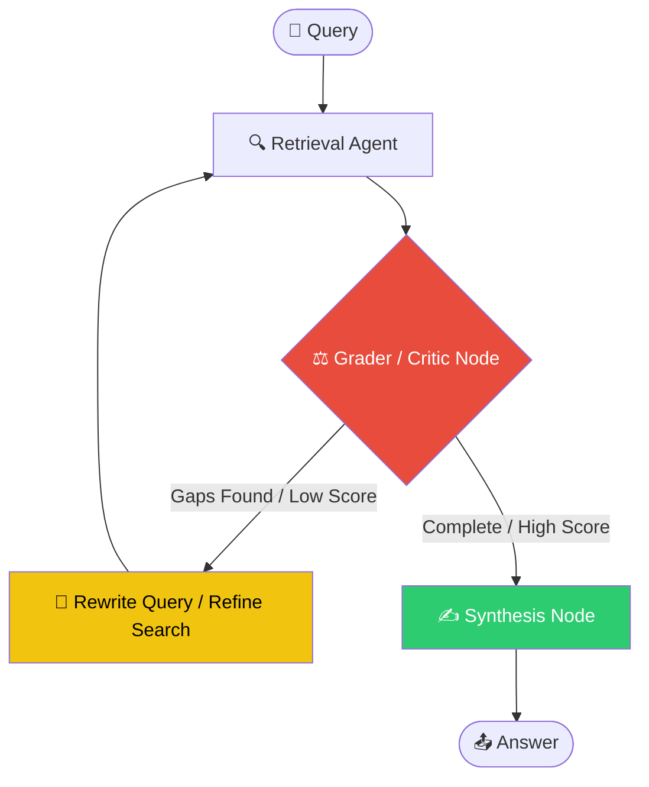
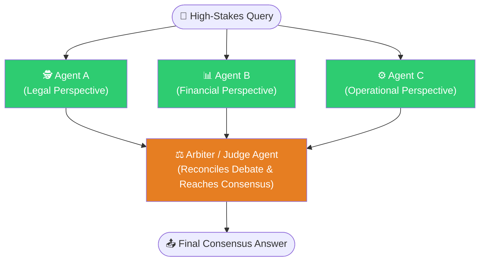
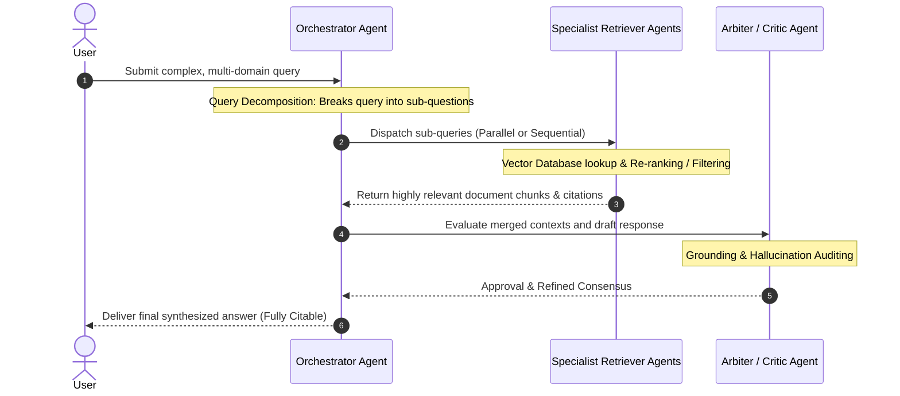

# Multi-Agent Retrieval-Augmented Generation (RAG) — A Comprehensive Overview

## Table of Contents
1. [What Is It?](#what-is-it)
2. [Why Does It Exist?](#why-does-it-exist)
3. [How It Works — Core Mechanics](#how-it-works--core-mechanics)
4. [The Four Main Paradigms](#the-four-main-paradigms)
   * [Paradigm 1: Hierarchical (Orchestrator-Worker)](#paradigm-1-hierarchical-orchestrator-worker)
   * [Paradigm 2: Sequential / Multi-Hop Chain](#paradigm-2-sequential--multi-hop-chain)
   * [Paradigm 3: Iterative / Self-Correcting (Agentic Loop)](#paradigm-3-iterative--self-correcting-agentic-loop)
   * [Paradigm 4: Collaborative / Debate (Multi-Agent Consensus)](#paradigm-4-collaborative--debate-multi-agent-consensus)
5. [Full Workflow Breakdown](#full-workflow-breakdown)
6. [Pros & Cons Comparison](#pros--cons-comparison)

---

## What Is It?

Standard RAG is straightforward: 
$$\text{User Query} \longrightarrow \text{Retrieve Documents} \longrightarrow \text{LLM Synthesis} \longrightarrow \text{Final Answer}$$

While this works for simple, single-hop questions, it breaks down quickly when queries are complex, multi-step, require reasoning across multiple heterogeneous sources, or need highly specialized domain knowledge.

**Multi-Agent RAG** solves this by distributing the retrieval and reasoning workload across a cooperative network of specialized AI agents. Instead of one monolithic LLM trying to execute all retrieval, sorting, grading, and synthesis, you employ an **orchestrator agent** that decomposes the problem, routes sub-questions to specialized **retriever agents**, and synthesizes their modular outputs into a single, cohesive, fact-traced response.

---

## Why Does It Exist?

Single-agent RAG has fundamental limitations:
1. **Linear Lookup**: It retrieves once, reasons once, and answers once.
2. **No Fact Verification**: It cannot iteratively verify facts or double-check its own assumptions.
3. **Silo Blindness**: It cannot easily parallelize or balance search logic across vastly different knowledge bases (e.g. Legal documents vs. Technical code repos).
4. **Multi-Hop Blindness**: It fails on queries where the answer to question A is required before you can construct the search query for question B.

Multi-Agent RAG was created to overcome these boundaries, bringing dynamic planning, specialized roles, collaborative debate, and self-reflection to information retrieval.

---

## How It Works — Core Mechanics

The system operates on four fundamental, highly coordinated operations:

1. **Query Decomposition**: The orchestrator takes a complex question (e.g., *"What are the tax and legal implications of the recent FDA drug approval for this compound?"*) and splits it into independent sub-queries: one for tax law, one for FDA regulatory history, and one for compound clinical research.
2. **Parallel or Sequential Retrieval**: Sub-queries fan out to specialist retrieval agents. These run in **parallel** when sub-queries are independent, or **sequentially** (multi-hop) when earlier results are needed to formulate subsequent queries.
3. **Re-Ranking & Filtering**: Each specialist agent scores and filters its retrieved chunks using cross-encoders or custom re-rankers before returning results, discarding low-relevance noise.
4. **Synthesis**: The orchestrator integrates all retrieved modular contexts into a final prompt for the generator LLM, compiling a coherent answer complete with citations traced back to each source agent.

---

## The Four Main Paradigms

---

### Paradigm 1: Hierarchical (Orchestrator-Worker)

A single planner/orchestrator LLM decomposes the query, dispatches worker retrieval agents in parallel, gathers their outputs, and synthesizes the final result. Workers are stateless, specialized, and interchangeable.

> [!TIP]
> **When to use**: When you have clearly separable knowledge domains and want fast, concurrent retrieval. Perfect for enterprise Q&A, research assistants, and corporate knowledge hubs.

---

### Paradigm 2: Sequential / Multi-Hop Chain

Agents run in a sequential chain. Each agent's retrieved output becomes the input context or key variable to formulate the query for the next agent in the sequence.

> [!IMPORTANT]
> **When to use**: Complex reasoning chains, knowledge graph traversal, or historical timelines where you cannot formulate the query for step 2 without the answer from step 1. E.g., *"What are the recent lawsuits against the CEO of the company that acquired Acme Corp last year?"*

---

### Paradigm 3: Iterative / Self-Correcting (Agentic Loop)

An agent retrieves context, evaluates its own retrieved information using a grader/critic, decides whether it is sufficient to fully answer the query, and loops back to rewrite and retrieve again if there are gaps.

> [!NOTE]
> **When to use**: Vague or ambiguous queries, sparse or highly heterogeneous knowledge bases, or scenarios requiring absolute accuracy over low latency (e.g. medical diagnosis research, deep legal discovery, scientific audits).

---

### Paradigm 4: Collaborative / Debate (Multi-Agent Consensus)

Multiple specialized agents independently retrieve sources and generate answers from their unique domain perspectives, and a centralized **Judge/Arbiter** agent reconciles their debates to produce a unified, consensus-based report.

> [!CAUTION]
> **When to use**: High-stakes decisions, controversial topics, medical second opinions, and financial risk reviews where single-perspective bias could lead to failure and where combining divergent perspectives adds substantial value.

---

## Full Workflow Breakdown

---

## Pros & Cons Comparison

| Dimension | Paradigm 1: Hierarchical | Paradigm 2: Sequential | Paradigm 3: Iterative | Paradigm 4: Collaborative |
| :--- | :--- | :--- | :--- | :--- |
| **Speed** | 🚀 **Fast** (Parallelized fan-out) | 🐢 **Slow** (Step-by-step chaining) | 🔄 **Variable** (Dependent on loops) | ⏱️ **Moderate** (Simultaneous debate) |
| **Accuracy** | High for multi-domain queries | High for chained, multi-hop facts | **Very High** (Continuous reflection) | 👑 **Highest** (Bias elimination) |
| **Operational Cost**| Medium | Medium | High (Multiple API calls/loops) | High ($N \times \text{LLM}$ calls) |
| **Complexity** | Medium | Low | High | High |
| **Primary Failure Mode**| Orchestrator mis-routes | Early hop errors propagate | Infinite loops without capping | Arbiter bias or debate stalemate |
| **Best For** | Enterprise Q&A, modular search | Knowledge graphs, sequential timelines | Ambiguous queries, research audits | Medical/Financial high-stakes consensus |
