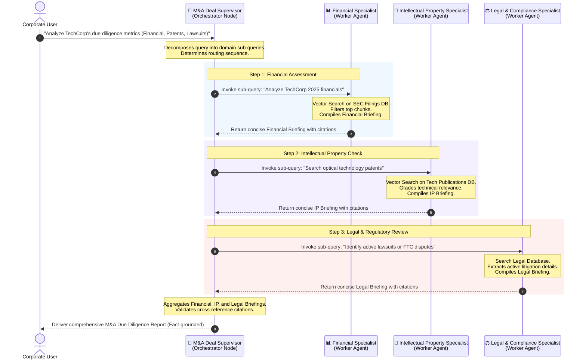

# Hierarchical Multi-Agent RAG (Orchestrator-Worker Pattern)

## Table of Contents
1. [What Is Hierarchical Multi-Agent RAG?](#what-is-hierarchical-multi-agent-rag)
2. [How It Works: The Complete Process](#how-it-works-the-complete-process)
3. [Why and When to Use It](#why-and-when-to-use-it)
4. [Full Workflow Diagram](#full-workflow-diagram)
5. [Pros and Cons](#pros-and-cons)
6. [Building from Scratch in LangGraph](#building-from-scratch-in-langgraph)
7. [Enterprise M&A Case Study Overview](#enterprise-ma-case-study-overview)

---

## What Is Hierarchical Multi-Agent RAG?

In standard single-agent or routing RAG architectures, a single Language Model is responsible for parsing a query, selecting the correct tool or search index, retrieving data chunks, reading through all the retrieved context, and synthesizing the final answer. 

While this works for simple lookups, it suffers from severe limitations when applied to **complex, multi-domain, or enterprise-scale problems**. For example, if a query requires reading across SEC filings, technical patent databases, and legal case law, a single LLM's context window can be easily overwhelmed by noise. Worse, the LLM may fail to coordinate the distinct search strategies required for each specific source.

**Hierarchical Multi-Agent RAG** addresses this by applying a corporate organizational structure to information retrieval. It establishes a two-tiered hierarchy:
1. **Orchestrator (The Supervisor / Planner)**: A high-level agent responsible for query decomposition, dynamic routing, worker task assignment, quality assurance, and final synthesis.
2. **Workers (Specialists)**: A set of highly focused, localized agents (often modeled as subgraphs or ReAct agents) that are domain-experts in a single database or knowledge repository. Each worker possesses its own specialized retrieval tools, embedding models, and search logic.

```
                  ┌───────────────────────────────┐
                  │       👤 User Query           │
                  └───────────────┬───────────────┘
                                  │
                                  ▼
                  ┌───────────────────────────────┐
                  │   🧠 M&A Deal Supervisor      │ (Orchestrator / Router)
                  └──────┬────────┬────────┬──────┘
                         │        │        │
         ┌───────────────┘        │        └───────────────┐
         ▼                        ▼                        ▼
┌─────────────────┐      ┌─────────────────┐      ┌─────────────────┐
│ 📊 Financial RAG│      │ 🔬 Patent RAG   │      │ ⚖️ Legal RAG     │ (Specialist Workers)
│ (SEC Filings DB)│      │ (Tech Papers DB)│      │ (Compliance DB) │
└─────────────────┘      └─────────────────┘      └─────────────────┘
```

---

## How It Works: The Complete Process

The execution of a Hierarchical Multi-Agent RAG flow proceeds in five distinct phases:

### 1. Query Decomposition & Planning
When the Orchestrator receives a complex multi-part query, it does not immediately execute a search. Instead, it evaluates the query against the capabilities of its available workers. It breaks the user query down into distinct, specialized sub-queries.
* *Example User Query*: *"Evaluate TechCorp's 2025 financial health, check their recent optical patents, and verify if they have any pending FTC antitrust litigation."*
* *Decomposed Sub-Queries*:
  1. Financial: Retrieve 2025 income statements and balance sheets for TechCorp.
  2. IP/Tech: Search patent records for TechCorp's optical engineering filings.
  3. Legal: Search federal compliance databases for FTC antitrust lawsuits against TechCorp.

### 2. Dynamic Routing & Worker Dispatch
The Orchestrator maintains state and uses **Structured Outputs** (via tools or Pydantic schemas) to determine which worker to invoke next. In a parallel setting, it dispatches all relevant workers concurrently. In a sequential setting (e.g., if finding the lawsuits depends on discovering the patent names first), it routes step-by-step.

### 3. Isolated Specialized Retrieval (Worker Execution)
Each worker executes in its own isolated node or subgraph:
* It reformulates the incoming sub-query specifically for its targeted vector database.
* It invokes specialized retrieval tools (e.g., dense vector search, hybrid keyword search, or BM25).
* It scores, grades, and filters the retrieved chunks, removing low-relevance noise.
* It synthesizes a concise, fact-grounded **Domain Briefing** containing only high-value facts and citations.

### 4. Information Hiding & Communication
To prevent context window bloat and "lost-in-the-middle" issues for the Orchestrator, Hierarchical RAG utilizes an **Information Hiding** pattern. Instead of sending raw document chunks (thousands of tokens of text) back to the Orchestrator, the workers compile a concise summary report. The Orchestrator *only* sees the final summary briefings, keeping its context clean and focused on high-level planning.

### 5. Multi-Source Synthesis & Citation Tracing
Once all workers have reported back, the Orchestrator aggregates the domain briefings. It performs a final reasoning step to combine the heterogeneous information, traces citations back to their source agents, and writes a comprehensive, multi-perspective response to the user.

---

## Why and When to Use It

### When to Use Hierarchical RAG:
* **Heterogeneous Data Formats**: When your enterprise data is scattered across completely different structures (e.g., highly structured SEC financial tables, unstructured scientific patent publications, and semi-structured legal PDF briefs).
* **Context Overload**: When retrieving raw documents from all domains simultaneously would exceed LLM context limits or dilute attention, leading to hallucinations.
* **Isolated Search Strategies**: When different knowledge bases require unique search mechanisms (e.g., financial data needs precise SQL or table lookup; technology papers need hybrid semantic search; legal data needs Boolean keyword queries).
* **High-Stakes Decision Support**: When errors or missed documents carry significant financial or regulatory risks (e.g., M&A due diligence, legal audits, medical diagnostic reviews).

> [!TIP]
> If your system is retrieving from a single, unified database of general corporate wiki pages, standard RAG is sufficient. Transition to Hierarchical RAG only when you have **distinct, domain-specific databases** that require specialized retrieval logic.

---

## Full Workflow Diagram

The following diagram illustrates the complete control flow, execution loop, and data separation between the Orchestrator and the specialized Retrieval Workers.



---

## Pros and Cons

| Feature | Pros | Cons |
| :--- | :--- | :--- |
| **Context Optimization** | 🚀 **Excellent**. Information hiding ensures the central planner's context window stays clean and free of raw retrieval noise. | ⚠️ **Slightly higher total token usage** due to workers performing intermediary synthesis. |
| **Retrieval Precision** | 🎯 **High**. Each agent uses tools optimized for its database (e.g. dense vector search, hybrid retrieval, SQL). | 🛠️ **Higher upfront setup** needed to tune individual worker tools and prompts. |
| **System Scalability** | 📈 **Seamless**. You can add new workers (e.g. "HR Expert", "Supply Chain Expert") by modifying the supervisor's router schema. | 🔀 **Supervisor complexity** increases as routing options grow. |
| **Failure Isolation** | 🛡️ **Robust**. A failure in the legal database search does not break the financial analysis; the supervisor can gracefully report legal data missing. | 🔄 **Propagation Risks**. If the supervisor fails to decompose the initial query properly, workers will retrieve irrelevant data. |
| **Execution Latency** | ⚡ **Parallelizable**. Independent queries run simultaneously in sub-graphs. | 🐢 **Sequential overhead** if agent steps have rigid dependency chains. |

---

## Building from Scratch in LangGraph

To build a robust Hierarchical Multi-Agent RAG system in LangGraph, you must master three main components:

### 1. Define the Global & Local States
We maintain a parent state (`M&ADiligenceState`) to manage the high-level communications, and local worker states (or parameters) to handle retrieval specifics.

```python
from langgraph.graph import MessagesState

class M&ADiligenceState(MessagesState):
    # Tracks which agent the supervisor chooses to route to next
    next_agent: str
    # Holds compiled briefings returned by specialist workers
    financial_brief: str
    ip_brief: str
    legal_brief: str
```

### 2. Structured Orchestrator Routing
Instead of raw text output, the Orchestrator uses Pydantic structured output (`with_structured_output`) to decide the next step. This guarantees deterministic state transitions.

```python
from pydantic import BaseModel, Field
from typing import Literal

class RouterDecision(BaseModel):
    next: Literal["financial_worker", "ip_worker", "legal_worker", "FINISH"] = Field(
        description="Choose the next expert worker to consult, or FINISH if you have all facts."
    )
    sub_query: str = Field(description="The specific question/query formulated for the selected specialist worker.")
    reasoning: str = Field(description="Explanation of why this path was chosen.")
```

### 3. Information Hiding Wrapper
Rather than registering a worker's raw database search directly as a node in the supervisor graph, we wrap the worker agent. The wrapper runs the worker, extracts the structured briefing, and returns it to the parent state:

```python
def run_financial_worker(state: M&ADiligenceState) -> dict:
    # 1. Fetch current sub-query formulated by supervisor
    query = state["messages"][-1].content
    # 2. Invoke specialized agent (running tools, vector retrievers, re-ranking)
    result = financial_agent_compiled.invoke({"messages": [HumanMessage(content=query)]})
    # 3. Return summary report to CEO state (Information Hiding)
    final_brief = result["messages"][-1].content
    return {
        "messages": [AIMessage(content=f"[FINANCIAL REPORT]: {final_brief}", name="FinancialWorker")],
        "financial_brief": final_brief
    }
```

---

## Enterprise M&A Case Study Overview

In our code implementation (`24_hierarchical_rag.py`), we simulate a real-world mergers and acquisitions due diligence process for a fictitious target company, **"QuantumTech Inc."**

We build three mock vector databases containing rich, detailed documents:
1. **SEC Financial Database**: Storing annual balance sheets, operating revenues, debt ratios, and EBITDA tables for QuantumTech.
2. **Patent Database**: Storing patents on quantum encryption chips, silicon photonics, and hardware keys.
3. **Legal Litigation Database**: Storing ongoing class-action lawsuits, FTC antitrust reviews, and compliance records.

The **M&A Deal Supervisor** coordinates searches across these three distinct sources, digests their findings, and builds a professional, integrated investment risk report complete with domain citations.
