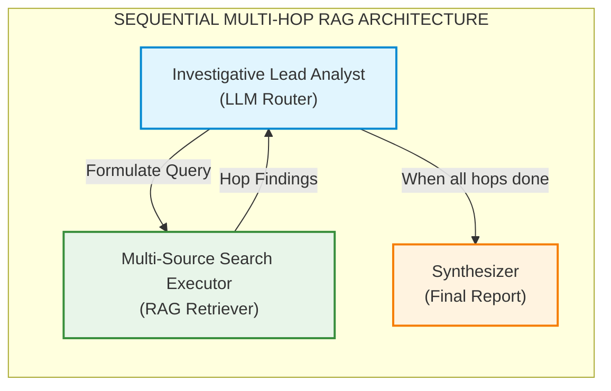
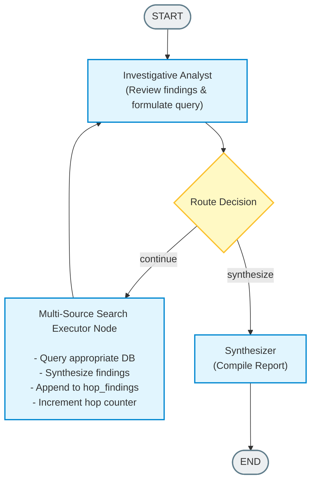

# Sequential / Multi-Hop Chain RAG (Multi-Agent RAG Paradigm)

## Table of Contents
1. [What is Sequential / Multi-Hop Chain RAG?](#what-is-sequential--multi-hop-chain-rag)
2. [How It Works - The Complete Process](#how-it-works---the-complete-process)
3. [Full Workflow Diagram](#full-workflow-diagram)
4. [Why and When to Use It](#why-and-when-to-use-it)
5. [Pros and Cons](#pros-and-cons)
6. [Building from Scratch in LangGraph](#building-from-scratch-in-langgraph)
7. [Real-World Case Study: Corporate Supply Chain Risk Audit](#real-world-case-study-corporate-supply-chain-risk-audit)

---

## What is Sequential / Multi-Hop Chain RAG?

**Sequential / Multi-Hop Chain RAG** is a retrieval-augmented generation paradigm where a single complex question cannot be answered by a single database lookup. Instead, the system must perform **multiple sequential retrieval steps (hops)**, where the output of each hop dynamically determines the query for the next hop.

### The Core Insight

Consider this question:

> "Is the critical chip supplier of QuantumTech Inc. owned by any entity currently under U.S. sanctions?"

No single database contains the full answer. You need to:

1. **Hop 1**: Look up QuantumTech's supply chain records to find who their critical chip supplier is (e.g., "CryoSystems Ltd.").
2. **Hop 2**: Look up corporate registries to find CryoSystems Ltd.'s parent holding company (e.g., "Vanguard Industrial Holdings").
3. **Hop 3**: Look up OFAC/sanctions databases to check if Vanguard Industrial Holdings is sanctioned (e.g., "Yes, under EO-14071 for Belarus operations").
4. **Hop 4**: Look up Vanguard's global subsidiary list to identify all operations in sanctioned jurisdictions (e.g., "Active subsidiaries in Minsk, Belarus and Crimea, Ukraine").

Each hop **depends on the findings of the previous hop**. This is the fundamental difference from parallel retrieval (like Hierarchical RAG) where all queries are independent.

### Key Terminology

| Term | Definition |
|------|-----------|
| **Hop** | A single retrieval step that queries a knowledge source and returns findings |
| **Multi-Hop Chain** | The sequential pipeline of dependent hops that builds up a complete answer |
| **Hop Query** | A dynamically formulated search query, generated from prior hop findings |
| **Hop Findings** | The synthesized result of a single retrieval step |
| **Chain Lineage** | The traceable, auditable sequence of queries and findings across all hops |
| **Bridge Entity** | An entity discovered in one hop that becomes the search target of the next hop |

### How It Differs from Other RAG Paradigms

| Feature | Single-Shot RAG | Hierarchical RAG | Sequential Multi-Hop RAG |
|---------|----------------|-------------------|--------------------------|
| **Retrieval Steps** | 1 | Multiple (parallel) | Multiple (sequential) |
| **Query Dependencies** | None | Independent sub-queries | Each query depends on prior findings |
| **Agent Structure** | Single retriever | Orchestrator + parallel workers | Analyst loop + sequential executor |
| **Best For** | Simple factual lookups | Multi-domain audits | Investigative, chain-of-evidence queries |
| **Latency** | Lowest | Medium (parallel) | Higher (sequential) |
| **Reasoning Depth** | Shallow | Broad but shallow | Deep and connected |

---

## How It Works - The Complete Process

The Sequential Multi-Hop Chain RAG operates as a **controlled reasoning loop** between two core components:

### Step-by-Step Process

#### Phase 1: Query Intake and Initial Decomposition
The system receives a complex user inquiry. An **Investigative Analyst** (LLM-powered reasoning node) analyzes the query and identifies that it requires multi-hop retrieval. It formulates the **first hop query** targeting the most foundational piece of missing information.

#### Phase 2: The Hop Loop (Iterative Retrieval)
The system enters a loop:

1. **Analyst Node** formulates a targeted query based on:
   - The original user question
   - All findings accumulated from previous hops
   - What information is still missing

2. **Search Executor Node** takes the formulated query and:
   - Queries the appropriate knowledge source (vector store, database, API)
   - Retrieves raw documents/records
   - Synthesizes the findings into a concise, fact-grounded summary

3. **State Update**: The hop findings are appended to the state, the hop counter increments, and control returns to the Analyst.

4. **Analyst Decision**: The Analyst reviews all accumulated findings and decides:
   - **"continue"**: More information is needed. Formulate the next hop query.
   - **"synthesize"**: All necessary evidence has been gathered. Compile the final report.

#### Phase 3: Final Synthesis
Once the Analyst determines that sufficient evidence has been collected across all hops, it compiles a comprehensive, traceable report that:
- Chains all findings into a coherent narrative
- Shows the exact hop-by-hop investigative trail
- Provides a clear, evidence-backed conclusion

### The Information Flow

```mermaid
flowchart TD
    User["User Question"] --> Analyst1["Analyst Node:<br>'What supplier provides chips to QuantumTech?'"]
    Analyst1 --> Search1["Search Supply Chain DB"]
    Search1 --> Finding1["Hop 1 Finding:<br>'CryoSystems Ltd.'"]
    
    Finding1 --> Analyst2["Analyst Node:<br>'Who is the parent company of CryoSystems Ltd.?'"]
    Analyst2 --> Search2["Search Corporate Registry"]
    Search2 --> Finding2["Hop 2 Finding:<br>'Vanguard Industrial Holdings (78% stake)'"]
    
    Finding2 --> Analyst3["Analyst Node:<br>'Is Vanguard Industrial Holdings under any sanctions?'"]
    Analyst3 --> Search3["Search OFAC Sanctions DB"]
    Search3 --> Finding3["Hop 3 Finding:<br>'Yes, EO-14071, Belarus operations'"]
    
    Finding3 --> Analyst4["Analyst Node:<br>'What subsidiaries does Vanguard operate in sanctioned jurisdictions?'"]
    Analyst4 --> Search4["Search Global Subsidiaries DB"]
    Search4 --> Finding4["Hop 4 Finding:<br>'Minsk Belarus, Crimea Ukraine'"]
    
    Finding4 --> Analyst5["Analyst Node:<br>SYNTHESIZE (All evidence gathered)"]
    Analyst5 --> Report["Final Investigative Report"]

    classDef analyst fill:#e1f5fe,stroke:#0288d1,stroke-width:2px;
    classDef search fill:#e8f5e9,stroke:#388e3c,stroke-width:1px;
    classDef finding fill:#fff3e0,stroke:#f57c00,stroke-width:1px;
    classDef io fill:#eceff1,stroke:#607d8b,stroke-width:2px;

    class User,Report io;
    class Analyst1,Analyst2,Analyst3,Analyst4,Analyst5 analyst;
    class Search1,Search2,Search3,Search4 search;
    class Finding1,Finding2,Finding3,Finding4 finding;
```



---

## Full Workflow Diagram

### High-Level Architecture



### Detailed State Machine



---

## Why and When to Use It

### When to Use Sequential Multi-Hop RAG

1. **Investigative Queries**: Questions that require following a chain of evidence across multiple data sources (e.g., forensic accounting, compliance audits, intelligence analysis).

2. **Entity Resolution Chains**: When you need to resolve relationships like "Company A -> Supplier B -> Parent Company C -> Sanctioned Entity D".

3. **Temporal Reasoning**: Questions requiring sequential time-based lookups (e.g., "What was the stock price of company X on the day AFTER they filed the patent that was LATER cited in lawsuit Y?").

4. **Dependency-Driven Research**: Academic research where Paper A cites Paper B, which builds on Dataset C, which was generated by Method D.

5. **Root Cause Analysis**: Debugging chains where "Error A was caused by Config B, which was changed by Deploy C, which was triggered by PR D".

### When NOT to Use It

- **Simple factual lookups**: Use single-shot RAG instead.
- **Multi-domain but independent queries**: Use Hierarchical RAG (parallel workers) instead.
- **Real-time, latency-sensitive applications**: Sequential hops add latency.
- **Questions where all sub-queries are known upfront**: Use parallel decomposition instead.

---

## Pros and Cons

### Pros

| Advantage | Description |
|-----------|-------------|
| **Deep Reasoning** | Can answer questions that require connecting dots across multiple knowledge sources |
| **Dynamic Query Formulation** | Each hop's query is intelligently crafted based on actual findings, not just template-based decomposition |
| **Traceable Audit Trail** | Every hop is logged with its query and findings, creating a fully auditable chain of evidence |
| **Handles Unknown Unknowns** | The system discovers what it needs to search for next based on what it finds, rather than requiring all sub-queries upfront |
| **Adaptive Depth** | The number of hops adapts to the complexity of the question - simple chains terminate early |
| **Reduced Hallucination** | Each hop is grounded in actual retrieved evidence before proceeding |

### Cons

| Disadvantage | Description |
|--------------|-------------|
| **Higher Latency** | Sequential nature means each hop must complete before the next begins |
| **Error Propagation** | A wrong finding in Hop 1 cascades incorrect queries through all subsequent hops |
| **Higher Token Cost** | Multiple LLM calls for routing decisions + synthesis at each hop |
| **Complexity** | More complex to implement and debug than single-shot or parallel RAG |
| **Loop Risk** | Without proper termination conditions (max hops), the system could loop indefinitely |
| **Requires Rich Knowledge Bases** | Each hop must find actionable "bridge entities" to chain to the next hop |

---

## Building from Scratch in LangGraph

### Step 1: Define the State

The state must track the hop lineage - what queries were asked, what was found, and where we are in the chain:

```python
from langgraph.graph import StateGraph, MessagesState, START, END
from typing import List, Literal
from pydantic import BaseModel, Field

class MultiHopState(MessagesState):
    current_hop: int              # Which hop we're on (starts at 1)
    max_hops: int                 # Safety limit to prevent infinite loops
    hop_queries: list[str]        # History of all queries formulated
    hop_findings: list[str]       # Synthesized findings from each hop
    next_step: str                # "continue" or "synthesize"
    final_report: str             # The completed investigation report
```

### Step 2: Define the Router Schema

The Analyst uses structured output to decide the next action:

```python
class HopDecision(BaseModel):
    next_step: Literal["continue", "synthesize"]
    next_query: str = Field(
        description="The dynamically formulated query for the next hop, "
                    "based on findings so far. Empty if synthesizing."
    )
    reasoning: str = Field(
        description="Explanation of what was found and what is still needed."
    )
```

### Step 3: Build the Analyst Node

```python
def investigative_analyst(state: MultiHopState):
    """The reasoning engine that formulates queries and decides when to stop."""

    # Build context from all previous hops
    hop_context = ""
    for i, (q, f) in enumerate(zip(state["hop_queries"], state["hop_findings"]), 1):
        hop_context += f"Hop {i} Query: {q}\nHop {i} Finding: {f}\n\n"

    system_prompt = f"""You are an investigative analyst. Your job is to
    answer the user's question by performing sequential searches.

    Previous hops:\n{hop_context}

    Decide: Do you need another search ("continue") or do you have
    enough evidence to compile a final report ("synthesize")?
    """

    decision = structured_llm.invoke([system_prompt] + state["messages"])

    return {
        "next_step": decision.next_step,
        "hop_queries": state["hop_queries"] + ([decision.next_query] if decision.next_step == "continue" else []),
    }
```

### Step 4: Build the Search Executor Node

```python
def search_executor(state: MultiHopState):
    """Executes the latest hop query against the knowledge base."""

    latest_query = state["hop_queries"][-1]

    # Query your vector store / database / API
    results = retrieval_tool(latest_query)

    # Synthesize findings
    synthesis = llm.invoke(f"Summarize these results for: {latest_query}\n{results}")

    return {
        "hop_findings": state["hop_findings"] + [synthesis.content],
        "current_hop": state["current_hop"] + 1,
    }
```

### Step 5: Build the Conditional Router

```python
def route_next_step(state: MultiHopState):
    if state["next_step"] == "synthesize" or state["current_hop"] >= state["max_hops"]:
        return "synthesizer"
    return "search_executor"
```

### Step 6: Assemble the Graph

```python
graph = StateGraph(MultiHopState)

graph.add_node("analyst", investigative_analyst)
graph.add_node("search_executor", search_executor)
graph.add_node("synthesizer", final_synthesizer)

graph.add_edge(START, "analyst")
graph.add_conditional_edges("analyst", route_next_step)
graph.add_edge("search_executor", "analyst")  # Loop back
graph.add_edge("synthesizer", END)

app = graph.compile()
```

---

## Real-World Case Study: Corporate Supply Chain Risk Audit

### Scenario

A multinational defense contractor, **AeroShield Defense Corp.**, is undergoing a **supplier compliance audit** mandated by the U.S. Department of Defense (DoD). The audit requires verifying that none of their critical component suppliers are owned by entities under U.S. sanctions or operating in sanctioned jurisdictions.

### The Question

> "Identify the primary supplier of radiation-hardened microprocessors to AeroShield Defense Corp., determine their corporate ownership structure, check if any parent entities are under OFAC sanctions, and map all subsidiary operations in sanctioned jurisdictions."

### Why Multi-Hop is Required

This question cannot be answered in a single search because:
- **Hop 1** discovers the supplier name (unknown beforehand)
- **Hop 2** discovers the parent company (depends on Hop 1's result)
- **Hop 3** discovers sanctions status (depends on Hop 2's result)
- **Hop 4** discovers subsidiary locations (depends on Hop 2's result + Hop 3's context)

### Expected Hop Chain

```
Hop 1: "Who supplies radiation-hardened microprocessors to AeroShield Defense Corp.?"
  --> Finding: "CryoSystems Ltd. (Contract #DOD-SC-2024-4471)"

Hop 2: "Who is the parent/holding company of CryoSystems Ltd.?"
  --> Finding: "Vanguard Industrial Holdings (78.3% stake, Luxembourg HQ)"

Hop 3: "Is Vanguard Industrial Holdings under any OFAC or international sanctions?"
  --> Finding: "Yes - Executive Order 14071, Belarus-related sanctions, listed 2023-09-15"

Hop 4: "What subsidiaries does Vanguard Industrial Holdings operate in sanctioned jurisdictions?"
  --> Finding: "VIH-Minsk (Belarus), VIH-Crimea (Ukraine), VIH-Tehran (Iran)"
```

### Final Synthesized Report

The system compiles all hop findings into a structured **Supply Chain Risk Assessment** with:
- A risk severity grade (CRITICAL)
- The complete chain of evidence
- Regulatory implications (ITAR violations, CAATSA exposure)
- Recommended actions (contract termination, alternative sourcing)

### Implementation

The complete implementation follows in the accompanying Python file. It includes:
- 4 mock knowledge bases (Supply Chain, Corporate Registry, OFAC Sanctions, Global Subsidiaries)
- Dynamic dual-provider LLM loading (OpenAI / Groq)
- Full hop-by-hop console tracing
- Comprehensive final synthesis
- Chain lineage audit log
