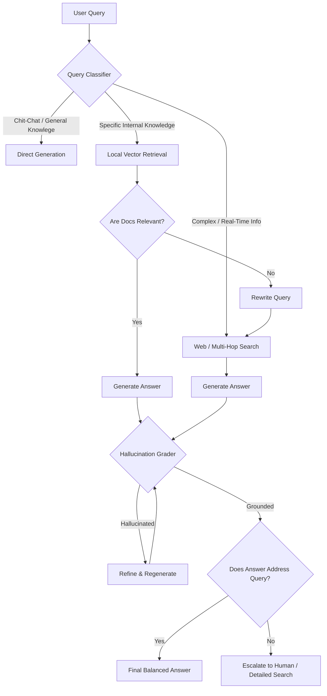
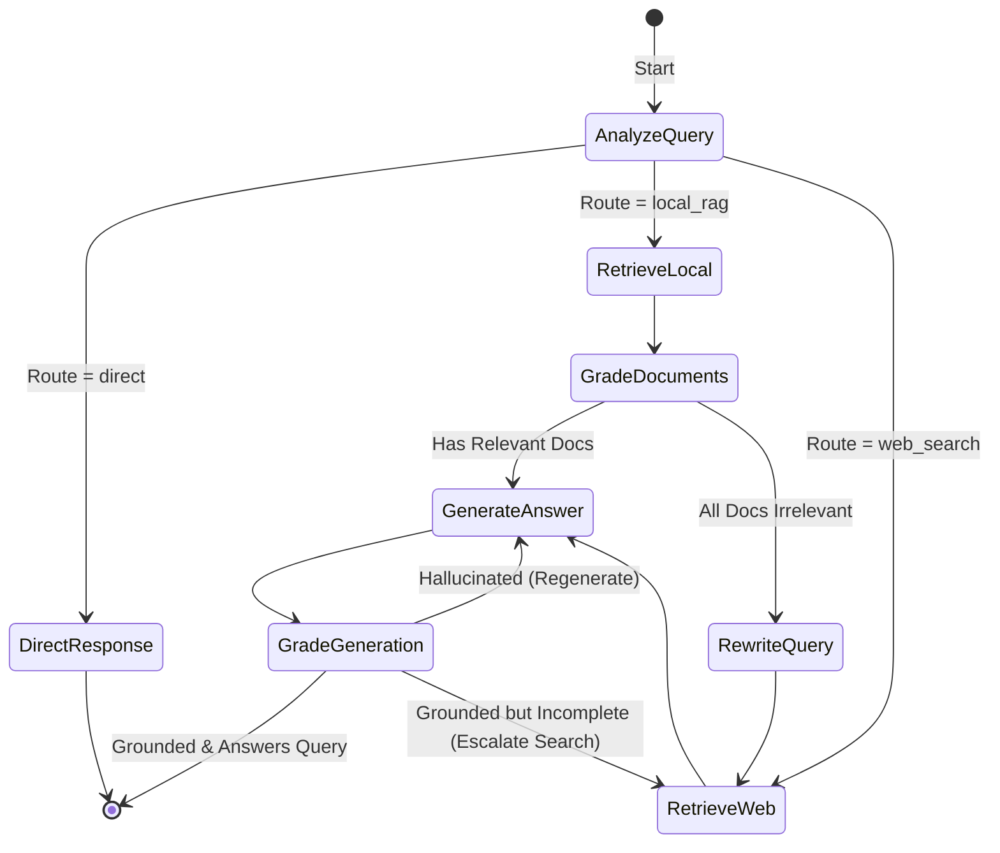

# Adaptive RAG (Adaptive Retrieval-Augmented Generation)

## Table of Contents
1. [What is Adaptive RAG?](#what-is-adaptive-rag)
2. [Why, When, and How to Use It](#why-when-and-how-to-use-it)
3. [Flowchart & State Machine](#flowchart--state-machine)
4. [Pros and Cons](#pros-and-cons)
5. [Real-World Case Study: Adaptive Tech Support System](#real-world-case-study-adaptive-tech-support-system)
6. [Building from Scratch in LangGraph](#building-from-scratch-in-langgraph)

---

## What is Adaptive RAG?

**Adaptive RAG** (introduced in papers like *Adaptive-RAG: Learning to Adapt Retrieval-Augmented Generation*) is an advanced RAG architecture that dynamically adapts its retrieval strategy based on the complexity and type of the incoming user query. 

Rather than treating all questions equally, Adaptive RAG uses a **Query Classifier/Router** (usually a fast, fine-tuned model or a structured LLM call) to analyze the query first. It then routes the request to the most efficient pipeline:
1. **No Retrieval (Direct Generation)**: For greetings, general knowledge, or simple conversational queries.
2. **Single-Hop / Standard RAG**: For queries requiring a quick lookup of specific documents in a local vector database.
3. **Multi-Hop / Web-Augmented RAG**: For complex, multi-part, or time-sensitive questions requiring multiple retrieval steps, query rewriting, or external web searching.

Additionally, it incorporates self-grading mechanisms (document relevance, hallucination, and answer verification) to guarantee response accuracy.

---

## Why, When, and How to Use It

### Why Use Adaptive RAG?
Standard RAG systems suffer from two main issues:
- **Inefficiency**: They retrieve documents even for simple queries like "Hello, how are you?" or basic programming syntax questions that the LLM already knows, wasting tokens and increasing latency.
- **Inadequacy**: They struggle with complex or time-sensitive queries that cannot be answered in a single vector retrieval step, leading to incomplete or outdated responses.

Adaptive RAG balances **latency, cost, and accuracy** by matching the query's complexity with the right execution path.

### When to Use It
- **Heterogeneous User Traffic**: In production systems (like customer support chatbots) receiving a mixture of chit-chat, simple FAQs, and highly complex technical troubleshooting questions.
- **Dynamic Data Requirements**: When some questions require internal corporate wikis, while others require real-time public web searches.
- **Latency and Budget Optimization**: When you want to minimize API calls and vector search compute overhead for trivial interactions.

### How it Works (The Core Steps)
1. **Query Analysis**: Analyze the query's intent, complexity, and temporal nature.
2. **Routing Decision**: Route to one of three paths: `direct_response`, `local_rag`, or `web_search`/`multi_hop`.
3. **Retrieval & Grading**: If retrieval is used, grade the retrieved documents for relevance.
4. **Iterative Refinement**: If documents are irrelevant, rewrite the query and fetch again (either locally or globally).
5. **Hallucination & Answer Grading**: Before returning the response, verify that the answer is grounded in the retrieved documents (no hallucinations) and fully answers the user's question.

---

## Flowchart & State Machine

### High-Level Routing & Refinement Workflow

### Detailed LangGraph State Machine

---

## Pros and Cons

### Pros
- **Optimized Latency**: Bypasses vector searches and document loading for simple or conversational inputs.
- **Cost Reduction**: Significantly lowers token counts by not feeding massive context windows to the LLM when unnecessary.
- **High Accuracy & Guardrails**: Evaluates both document relevance and answer faithfulness, virtually eliminating hallucinations.
- **Adaptability**: Flexes dynamically between local proprietary files and public web searching.

### Cons
- **Higher Routing Latency**: The initial routing step adds a small LLM overhead to every query (mitigated by using fast, lightweight models like Llama 3.1 8B).
- **Complexity**: Multiple state transitions, conditional edges, and structured outputs make the graph complex to design and debug.
- **Prompt Sensitivity**: Highly dependent on the quality of the grading and routing prompts.

---

## Real-World Case Study: Adaptive Tech Support System

### Scenario
An enterprise cloud hosting company, **CloudFlow Solutions**, wants to deploy an automated AI support engineer. The engineer receives three kinds of user messages:
1. **Greetings and general conversational messages** (e.g., "Hi, how do I contact billing?" or "Hello!").
2. **Standard documentation queries** (e.g., "What are your storage limits for VM Tier-2?").
3. **Complex, real-time troubleshooting or system status queries** (e.g., "Why is my VM instance in us-east-1 failing to connect right now?" or "Is there an outage in AWS right now?").

### The Approach
- **Direct Route**: Handles chit-chat and directs users to billing contacts without touching the technical knowledge base.
- **Local RAG Route**: Queries the internal Vector Database containing VM tiers, specifications, and SLA documents.
- **Web Search Route**: Triggers a live web search tool to fetch real-time service status, AWS outage reports, and external software patches.

---

## Building from Scratch in LangGraph

The implementation uses LangGraph's state graph structure to orchestrate routing, vector search, document relevance scoring, generation, and answer-faithfulness evaluation. The complete, executable code can be found in the accompanying Python script.
