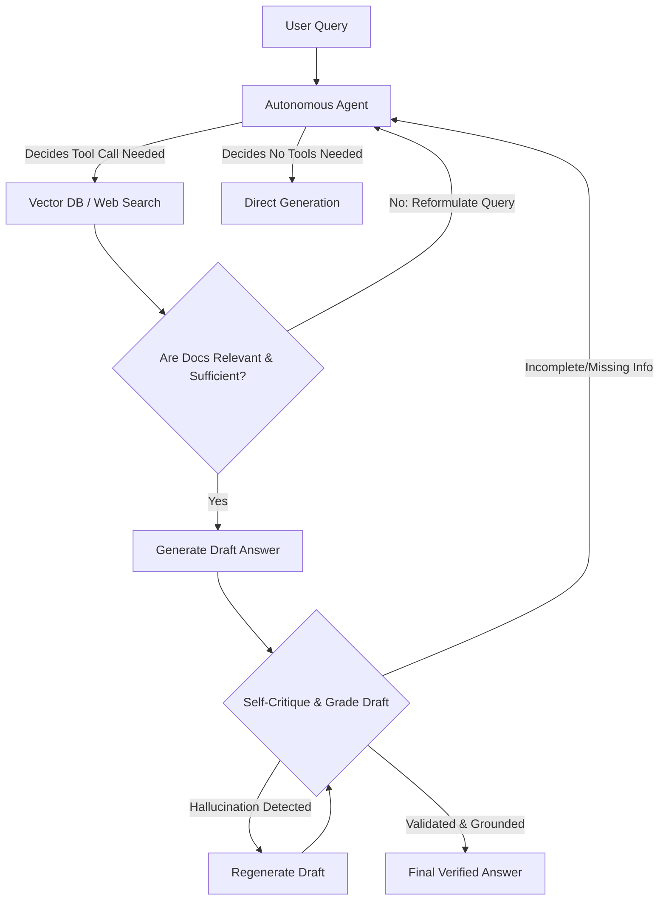
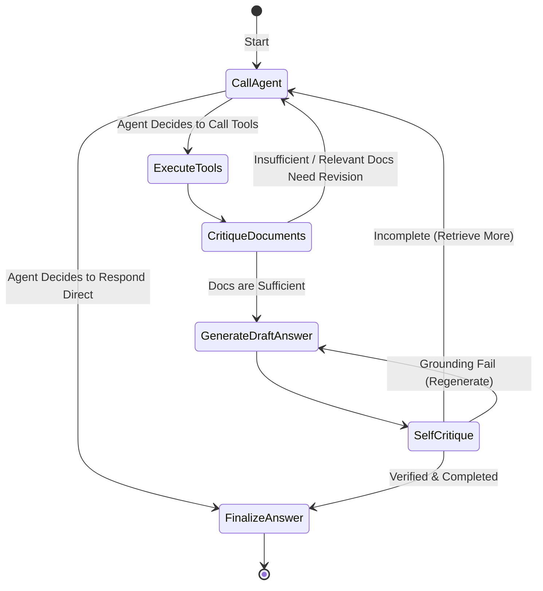

# Autonomous RAG (Self-Corrective & Critique-Driven RAG)

## Table of Contents
1. [What is Autonomous RAG?](#what-is-autonomous-rag)
2. [Why, When, and How to Use It](#why-when-and-how-to-use-it)
3. [Flowchart & State Machine](#flowchart--state-machine)
4. [Pros and Cons](#pros-and-cons)
5. [Real-World Case Study: Automated Research & Intelligence Analyst](#real-world-case-study-automated-research--intelligence-analyst)
6. [Building from Scratch in LangGraph](#building-from-scratch-in-langgraph)

---

## What is Autonomous RAG?

**Autonomous RAG** (often referred to as Self-RAG or Critique-Loop RAG) is a highly autonomous, agentic retrieval-augmented generation pattern where the agent does not follow a fixed routing pathway. Instead, the agent autonomously decides:
1. **Whether retrieval is even necessary** to answer the user request.
2. **Which retrieval tool** is best suited (e.g. Vector DB, internal documents, external web APIs).
3. **If the retrieved documents contain sufficient information** or if it needs to dynamically fetch more.
4. **Whether the generated response is fully grounded** in the retrieved context (checking for hallucinations).
5. **Whether the response is completely satisfying** or needs revision.

By placing retrieval and generation inside a self-corrective critique loop, the LLM continuously evaluates its own outputs, query parameters, and context quality, mimicking the workflow of a human researcher.

---

## Why, When, and How to Use It

### Why Use Autonomous RAG?
Traditional RAG and even Adaptive RAG rely on fixed routing pipelines (e.g., if query classification is X, do Y). However, complex queries are often unpredictable. 
Autonomous RAG treats retrieval as a **tool-use decision** inside an iterative loop. It solves:
- **Retrieval Inadequacy**: If the first query retrieves poor data, the LLM detects the deficit, reformulates the search parameters, and tries again.
- **Hallucinations**: It explicitly grades the generation against the retrieved data before presenting the final answer to the user.
- **Redundant Processing**: The agent stops fetching and iterating immediately once it verifies the query is answered.

### When to Use It
- **Unstructured / Open-Ended Investigations**: Financial research, legal due diligence, or market analysis where the depth of search needed is unknown beforehand.
- **Complex Troubleshooting**: Technical support situations where a sequence of distinct lookups is required to diagnose a problem.
- **High-Accuracy Domains**: Where factual errors or hallucinations are completely unacceptable and self-grading is mandatory.

### How it Works (The Core Loop)
1. **Initial Assessment**: The LLM determines if it has enough knowledge to answer or if it needs tools.
2. **Autonomous Tool Call**: Executes retrieval tools (Vector DB search, web search, etc.).
3. **Document Relevance Critique**: Evaluates retrieved text. If inadequate, it generates a new search query and loops back to retrieval.
4. **Draft Generation**: Builds a candidate response.
5. **Hallucination & Completeness Critique**: Evaluates the candidate response. If it fails, the agent either regenerates or searches again.
6. **Conclude**: Once the critique criteria are met, it serves the validated final response.

---

## Flowchart & State Machine

### High-Level Autonomous Loop Workflow

### Detailed LangGraph State Machine

---

## Pros and Cons

### Pros
- **Maximum Flexibility**: Handles arbitrary research tasks, multi-hop lookups, and unexpected search requirements.
- **Self-Healing**: Corrects its own mistakes, adjusts query keywords, and ignores irrelevant or noisy documents.
- **Unmatched Accuracy**: The rigorous double-pass grading (docs-to-query, generation-to-docs) ensures clean, factual answers.
- **Conversational Smoothness**: Handles normal conversation and deep information retrieval under a single unified state.

### Cons
- **Latency Spikes**: The agent can loop multiple times if it finds the documents insufficient, increasing response time.
- **High API Costs**: Iterative tool-use and self-reflection steps lead to multiple LLM calls per user prompt.
- **Complex Loop Termination**: Requires strict loop guards to prevent infinite retrieval cycles when matching documents don't exist.

---

## Real-World Case Study: Automated Research & Intelligence Analyst

### Scenario
An investment firm wants to automate their public equities research analyst. When a user asks a question about a company, the analyst needs to:
1. Determine what financial documents or public news articles it needs to read.
2. Formulate specific search parameters.
3. Review retrieved articles to ensure they contain hard numbers and verified facts (not rumors).
4. If an article doesn't answer the question (e.g. details about a specific executive transition), the analyst must dynamically formulate a secondary query (e.g. search for the executive's name) and read those documents.
5. Compile the research report, self-check for any factual discrepancies, and output the final verified dossier.

---

## Building from Scratch in LangGraph

We will implement this autonomous loop in LangGraph. The agent node uses a function-calling layout where it can output tool calls or choose to finalize the response. The state maintains an ongoing list of retrieved contexts, a critique log, and loop counters. The execution details are in the accompanying Python script.
