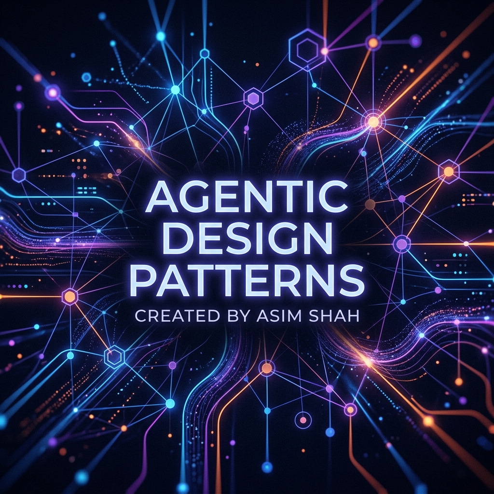

<div align="center">

# 🤖 Agentic Design Patterns


[](https://github.com/Asim-Shah-web)
[](https://www.linkedin.com/in/asim-shah-ai-dev/)
[](https://langchain-ai.github.io/langgraph/)

If you find this repository helpful, please consider giving it a ⭐ to help other learners discover it!

*A comprehensive, from-scratch guide to mastering Multi-Agent Systems (MAS) and Agentic Architectures.*

</div>

---

## 🌟 About This Repository

Welcome to the **Agentic Design Patterns** repository! 

I built this project during my own learning journey to help fellow developers and AI enthusiasts understand complex **Multi-Agent Systems** and **Agentic RAG** architectures from the ground up. 

Whether you are just starting with basic ReAct agents or building complex, hierarchical, debate-driven multi-agent ecosystems, this repository breaks down each concept into digestible, interactive tutorials. Every pattern includes:
- 📖 **Comprehensive Markdown Documentation** (Theory, Pros/Cons, Use Cases)
- 🐍 **Clean Python Implementations** (Built from scratch using LangGraph)
- 📓 **Interactive Jupyter Notebooks** (For hands-on execution and experimentation)

---

## 🏗️ Architecture Patterns Directory

Click on the folder emoji (📂) to explore the code, documentation, and notebooks for each architectural pattern.

| S.No | Architecture Name | Explore |
|:----:|:-------------------|:-------:|
| **1** | ReAct (Reason + Act) | [📂](./Pattern%2301%20ReAct) |
| **2** | Self-Reflection / Reflexion | [📂](./Pattern%2302%20Self_Reflection%20OR%20Reflexion) |
| **3** | Plan and Execute | [📂](./Pattern%2303%20Plan%20And%20Execute) |
| **4** | Human-In-The-Loop | [📂](./Pattern%2304%20Human-In-The-Loop) |
| **5** | Multi-Agent Systems Overview | [📂](./Pattern%2305%20Multi-Agent-Systems%20Overview) |
| **6** | Network (Swarm) Multi-Agent System | [📂](./Pattern%2306%20Network%20Multi-agent-system) |
| **7** | Hierarchical Multi-Agent System | [📂](./Pattern%2307%20Hierarchical%20Multi-agent-system) |
| **8** | Parallel Map-Reduce Multi-Agent System | [📂](./Pattern%2308%20Parallel%20Map-Reduce%20Multi-Agent-System) |
| **9** | Supervisor-As-Tools Multi-Agent System | [📂](./Pattern%2309%20Supervisor-As-Tools%20Multi-agent-system) |
| **10** | Agentic RAG | [📂](./Pattern%2310%20Agentic%20RAG) |
| **11** | Corrective RAG (Corrective-Rag-Paradigm) | [📂](./Pattern%2311%20Corrective%20RAG%20%28Corrective-Rag-Paradigm%29) |
| **12** | Self RAG (Self-Rag-Paradigm) | [📂](./Pattern%2312%20Self%20RAG%20%28Self-Rag-Paradigm%29) |
| **13** | Multi-Agentic RAG Overview | [📂](./Pattern%2313%20Multi-agentic-RAG%20Overview) |
| **14** | Hierarchical RAG (Multi-Agent Paradigm) | [📂](./Pattern%2314%20Hierarchical%20RAG%20%28Multi-agent-Rag-Paradigm%29) |
| **15** | Sequential Multi-Hop RAG (Multi-Agent Paradigm) | [📂](./Pattern%2315%20Sequential%20Multi-Hop%20RAG%20%28Multi-agent-Rag-Paradigm%29) |
| **16** | Collaborative Debate RAG (Multi-Agent Paradigm) | [📂](./Pattern%2316%20Collaborative%20Debate%20RAG%20%28Multi-agent-Rag-Paradigm%29) |
| **17** | Adaptive RAG (Adaptive-Rag-Paradigm) | [📂](./Pattern%2317%20Adaptive%20RAG%20%28Adaptive-Rag-Paradigm%29) |
| **18** | Autonomous RAG (Autonomous-Rag-Paradigm) | [📂](./Pattern%2318%20Autonomous%20RAG%20%28Autonomous-Rag-Paradigm%29) |

---

## 📚 Future Roadmap & Contributions

*   **PDF Pattern Notes:** I will be compiling a comprehensive, detailed PDF study guide covering all these Agentic Patterns in the near future. Stay tuned!
*   **Open-Source Contributions:** This repository is open to the community! If you are learning or building other agentic paradigms (e.g., Swarms, routing tricks, multi-modal agents) and want to add them as a pattern, you are highly welcome to open a Pull Request. Let's make this the ultimate learning hub for Agentic AI!

---

## 🚀 How to Use This Repository

1. **Clone the repo:**
   ```bash
   git clone https://github.com/AsimShah/Agentic-Design-Patterns.git
   cd Agentic-Design-Patterns
   ```
2. **Set up the Virtual Environment:**
   All dependencies are listed in `requirements.txt`.
   ```bash
   python -m venv virtEnvAgenticPatterns
   source virtEnvAgenticPatterns/bin/activate  # On Windows: virtEnvAgenticPatterns\Scripts\activate
   pip install -r requirements.txt
   ```
3. **Configure Environment Variables:**
   Create a `.env` file in the root directory and add your API keys (e.g., `OPENAI_API_KEY`, `GROQ_API_KEY`).
4. **Explore:** Open the Jupyter Notebooks inside each pattern's folder to run the agents step-by-step!
5. **Enhance Markdown Viewing:** 
   To view the workflow flowcharts and state machines, it is highly recommended to view the markdown files (`.md`) using an extension that supports **Mermaid.js** rendering. 
   *   For **VS Code**: Install the **Markdown Preview Enhanced** extension or the **Mermaid Preview** extension.
   *   For **GitHub**: Native rendering is supported out of the box!

---

## 👨‍💻 About the Author

**Built with ❤️ by Asim Shah**

I am passionate about Artificial Intelligence, LLMs, and building robust, autonomous agentic systems. I created this repository to bridge the gap between theoretical AI concepts and practical, production-ready code.

Let's connect and build the future of AI together!
- 💼 **LinkedIn:** [Connect with me](https://www.linkedin.com/in/asim-shah-ai-dev/)
- 🐙 **GitHub:** [Follow my projects](https://github.com/Asim-Shah-web)

If you find this repository helpful, please consider giving it a ⭐ to help other learners discover it!
